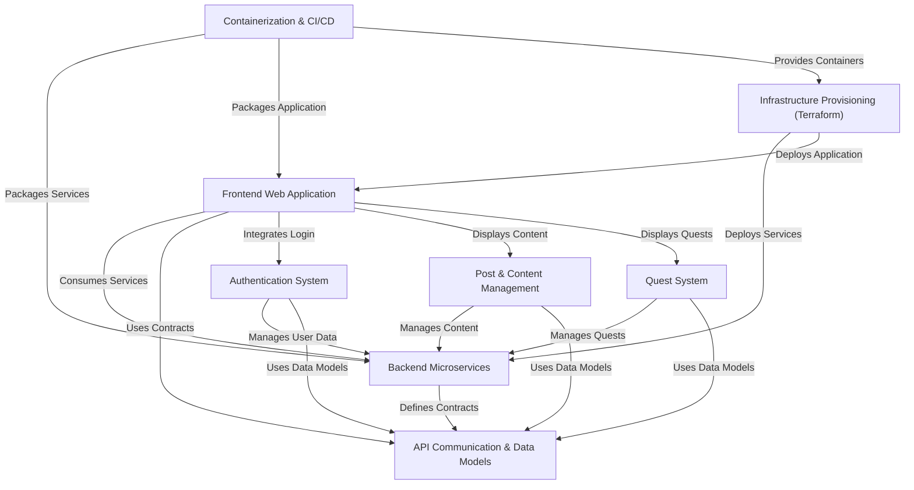

# Tutorial: Game_Devs_Connect

Game_Devs_Connect is an *online social platform* designed for **game developers** to connect and collaborate. Users can share ideas and progress through **posts** (including text and images), manage their *developer profiles*, and participate in a unique *quest system* to engage in challenges and tasks.

## Visual Overview

## Chapters

1. [Frontend Web Application
](01_frontend_web_application.md)
2. [Authentication System
](02_authentication_system.md)
3. [Post & Content Management
](03_post_content_management.md)
4. [Quest System
](04_quest_system.md)
5. [Backend Microservices
](05_backend_microservices.md)
6. [API Communication & Data Models
](06_api_communication_data_models.md)
7. [Containerization & CI/CD
](07_containerization_ci_cd.md)
8. [Infrastructure Provisioning (Terraform)
](08_infrastructure_provisioning_terraform.md)

---