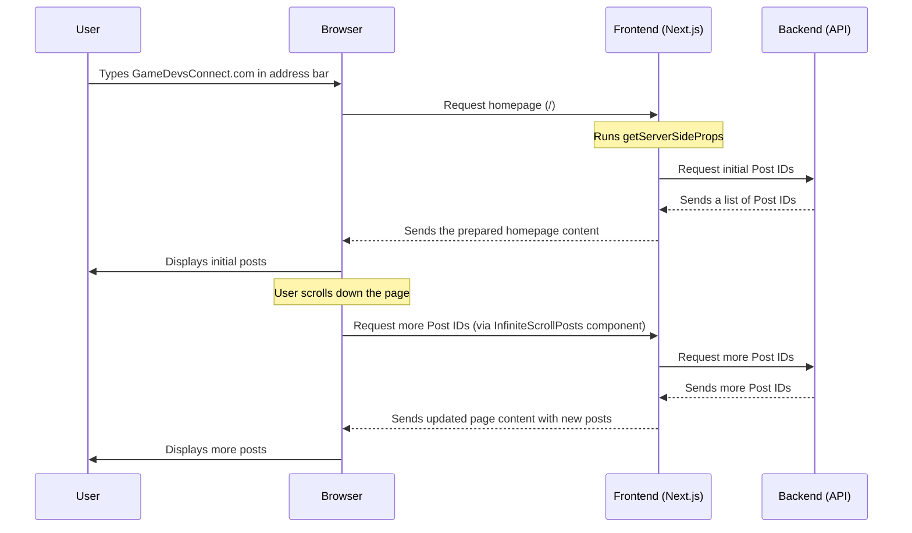

# Chapter 1: Frontend Web Application

Welcome to the `Game_Devs_Connect` project! In this first chapter, we're going to explore the very first thing you'll interact with: the **Frontend Web Application**. Think of it as the "face" or "control panel" of our entire system.

### What Problem Does It Solve?

Imagine you want to browse posts from other game developers, share your own projects, or participate in exciting "quests." How would you do that? You'd need a way to **see** all this information and **interact** with it. That's exactly what the Frontend Web Application does!

**Our Central Use Case:** Let's say you open your web browser and go to `Game_Devs_Connect`. The first thing you want to do is **browse posts** from other users. The Frontend is what makes this possible. It presents the posts nicely, allows you to scroll through them, and click on them.

### What is a Frontend Web Application?

The "Frontend" is simply **everything you see and interact with** when you use a website.
*   When you visit `Game_Devs_Connect`, all the buttons, text, images, and forms you see are part of the Frontend.
*   It's like the dashboard of a car: you see the speedometer, the fuel gauge, and buttons to turn on the radio or air conditioning. You interact with these controls to make the car do things.
*   For `Game_Devs_Connect`, our Frontend is built using a powerful tool called **Next.js**. Next.js helps us create a fast and interactive website that looks good and works smoothly.

### How Does It Help You Browse Posts?

When you visit `Game_Devs_Connect` (for example, `https://gamedevsconnect.com`), your web browser will load the main page. This main page is designed to show you a list of posts.

Let's look at a simplified version of the code that handles this:

```typescript
// GameDevsConnect.Frontend/GameDevsConnect.Frontend.Web/pages/index.tsx

import InfiniteScrollPosts from "@/components/infinite_scroll_posts";
import { getPostIdsAsync } from "@/services/post_service";

// This is the main page you see when you visit Game_Devs_Connect
export default function Home({ids}: {ids:string[]}) 
{
  // If a user is logged in, show the posts
  return (
    <>
    {/* This component displays many posts and loads more as you scroll */}
    <InfiniteScrollPosts initialIds={ids} search="" parentId=""/>
    </>
  )
}
```

**What this code does:**
*   This piece of code (`pages/index.tsx`) represents the "Home" page of our application.
*   When you visit the website's main address (`/`), Next.js uses this `Home` component to build what you see.
*   The `<InfiniteScrollPosts />` part is a special component that takes a list of `ids` (unique identifiers for posts) and displays the posts. It's smart enough to load more posts automatically as you scroll down the page, so you don't have to click "next page."

But where do those initial `ids` come from? They come from a special function that runs *before* the page is shown to you:

```typescript
// Part of: GameDevsConnect.Frontend/GameDevsConnect.Frontend.Web/pages/index.tsx

// This function runs on the server BEFORE the page is shown to you.
// It helps fetch the first set of post IDs.
export async function getServerSideProps()
{
  const response = await getPostIdsAsync(); // Ask for post IDs from the backend

  return {
    props: {
      ids: response.ids || [] // Pass the IDs to the Home component
    }
  }
}
```

**How it works:**
1.  When your browser asks for the `Game_Devs_Connect` homepage, Next.js first runs `getServerSideProps` on the server.
2.  `getServerSideProps` then asks our "Backend" (which we'll talk more about in [Backend Microservices](05_backend_microservices_.md)) for the latest post IDs using `getPostIdsAsync`.
3.  Once it gets the IDs, it passes them to the `Home` component.
4.  Finally, the `Home` component displays the posts using the `InfiniteScrollPosts` feature.

This ensures that when you first load the page, you immediately see some posts without having to wait for them to load separately.

### What Happens "Under the Hood"?

Let's trace the journey from you opening your browser to seeing posts on `Game_Devs_Connect`:



This diagram shows how the Frontend acts as a middleman, taking your requests, talking to the Backend (which stores all the actual data), and then presenting the information back to you in a friendly way. The communication between the Frontend and Backend happens using [API Communication & Data Models](06_api_communication___data_models_.md).

#### The Application's Foundation (`_app.tsx` and `layout.tsx`)

Every application needs a foundation. In `Game_Devs_Connect`, all our web pages share a common structure and functionality, defined in a couple of important files:

*   **`pages/_app.tsx`**: This file is the "root" of our web application. Think of it as the main entrance that *every* visitor passes through. It wraps all our individual pages (like the Home page, Login page, etc.) with common features.

    ```typescript
    // GameDevsConnect.Frontend/GameDevsConnect.Frontend.Web/pages/_app.tsx

    import Layout from "@/components/layout";
    import { SessionProvider } from "next-auth/react";
    import type { AppProps } from "next/app";

    // This file is like the main entry point for our web application.
    // It makes sure every page has the same "wrapper" (Layout)
    // and can access user login information (SessionProvider).
    export default function App({ Component, pageProps }: AppProps) 
    {
      return (
        // SessionProvider helps manage who is logged in (more in Chapter 2)
        <SessionProvider session={pageProps.session}>
          {/* Layout provides a common header, sidebar, etc., for all pages */}
          <Layout>
            {/* Component is the actual page being shown (e.g., Home, Login) */}
            <Component {...pageProps} />
          </Layout>
        </SessionProvider>
      )
    }
    ```
    **Explanation:** The `_app.tsx` file ensures that all pages benefit from a consistent `Layout` (like a consistent frame around all pictures) and can access user session information (e.g., whether you're logged in or not, which is crucial for the [Authentication System](02_authentication_system_.md)).

*   **`components/layout.tsx`**: This component defines the overall visual structure of our website, like where the navigation bar goes, where the main content appears, and so on.

    ```typescript
    // GameDevsConnect.Frontend/GameDevsConnect.Frontend.Web/components/layout.tsx

    import styles from '@/styles/layout.module.css'
    import Navbar from "./nav/navbar";
    import { useSession } from 'next-auth/react';

    // This component sets up the general structure for our website.
    // Imagine it as the frame that holds all the pictures (your pages).
    export default function Layout({children}:{children:any})
    {
        const {data:session} = useSession(); // Checks if a user is logged in

        return (
            <div className={styles.main}>
                <nav className={styles.sidebar}>
                    {/* Only show navigation if a user is logged in */}
                    {session && <Navbar/>}
                </nav>
                <div className={styles.child}>
                    {/* This is where the actual page content goes */}
                    {children}
                </div>
            </div>
        )
    }
    ```
    **Explanation:** This code defines our website's main structure. It creates a `sidebar` (where a navigation bar might be) and a `child` area where the actual content of each page (like the list of posts) will be placed. Notice how it checks if a user is `session` (logged in) before showing the `Navbar`.

#### Packaging the Frontend (`Dockerfile`)

Finally, how do we get this Frontend application ready to run on a server so everyone can access it? We use something called a `Dockerfile`. Think of a `Dockerfile` as a recipe for baking a cake:

```dockerfile
# GameDevsConnect.Frontend/GameDevsConnect.Frontend.Web/Dockerfile

# Stage 1: Build the application (like mixing ingredients and baking)
FROM node:23-alpine AS base
WORKDIR /app
COPY package.json .
COPY package-lock.json .
RUN npm ci # Install project dependencies
COPY . .    # Copy all source code
RUN npm run build # Prepare the Next.js application for deployment

# Stage 2: Create a smaller, final image for running (like packaging the finished cake)
FROM node:23-alpine AS final
WORKDIR /app
# Copy only the necessary built files and dependencies
COPY --from=base /app/.next .next
COPY --from=base /app/package.json .
COPY --from=base /app/package-lock.json .
COPY --from=base /app/public ./public
COPY --from=base /app/node_modules ./node_modules
CMD ["npm", "start"] # Command to start the application
```
**Explanation:** This recipe tells a special tool (Docker) how to:
1.  **Build** our Next.js application: It starts with a base "Node.js" environment, copies our code, installs necessary parts, and then "builds" the website (Stage 1).
2.  **Package** the ready-to-run application: It then takes only the essential parts of the built application and puts them into a smaller, cleaner package (Stage 2). This package is called a "container," which makes our application easy to run anywhere. We will learn more about this in [Containerization & CI/CD](07_containerization___ci_cd_.md).

### Conclusion

In this chapter, we learned that the **Frontend Web Application** is the part of `Game_Devs_Connect` that you see and interact with directly in your browser. It's built using **Next.js** and acts as your personal "control panel" to browse posts, manage your profile, and more. We saw how it uses pages like `index.tsx` to display content, how `_app.tsx` and `layout.tsx` provide a consistent structure, and how a `Dockerfile` prepares it for deployment.

However, before you can start browsing posts, `Game_Devs_Connect` needs to know who you are. This leads us to our next important topic: the **Authentication System**.

[Next Chapter: Authentication System](02_authentication_system.md)