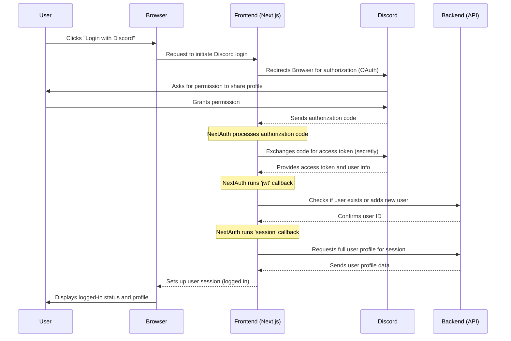

# Chapter 2: Authentication System

Welcome back to `Game_Devs_Connect`! In [Chapter 1: Frontend Web Application](01_frontend_web_application_.md), we learned how the Frontend is the friendly face of our application, letting you see and interact with posts. But imagine you want to **create** a new post, or save your favorite ones. How does the system know *who you are*? And how does it make sure only *you* can access *your* private information?

That's where the **Authentication System** comes in!

### What Problem Does It Solve?

Just like a private event needs a security checkpoint to verify attendees, `Game_Devs_Connect` needs a way to verify who is using the application.

**Our Central Use Case:** You want to **log into `Game_Devs_Connect` using your Discord account** so you can start sharing your game development projects and join quests. The Authentication System makes this secure and simple!

### What is an Authentication System?

Think of the Authentication System as the **security checkpoint** at a private event for game developers.
*   It's responsible for checking your **invitation** (your login details).
*   It **confirms your identity** (verifies it's really you).
*   And then, if you're approved, it **grants you access** to different areas and retrieves your unique attendee badge (your user profile).

For `Game_Devs_Connect`, we make this easy by letting you log in using your **Discord account**. This means you don't need to create a brand new username and password just for our platform!

### How Does Logging In Work? (The User Experience)

When you visit `Game_Devs_Connect`, you'll typically see a "Login with Discord" button.

1.  **Click the Button:** You click "Login with Discord."
2.  **Redirect to Discord:** Our application temporarily sends you to Discord's website.
3.  **Discord Asks Permission:** Discord asks you, "Do you allow `Game_Devs_Connect` to see your Discord username and profile picture?"
4.  **Grant Permission:** You click "Authorize."
5.  **Back to `Game_Devs_Connect`:** Discord sends you back to our application, and magically, you're logged in! Your profile picture and username appear.

This entire process relies on a standard method called **OAuth**.

#### What is OAuth?

OAuth is like a special "valet key" for your car.
*   You don't give the valet your *master key* (your Discord password).
*   Instead, you give them a *special key* that only lets them park your car (access specific information like your username) but not open your trunk or drive away permanently.

Similarly, when you log in with Discord using OAuth, you're giving `Game_Devs_Connect` a limited "token" (a special, temporary key) that lets us access *only* the specific information you approve (like your username and avatar), without ever knowing your Discord password.

#### User Sessions: Staying Logged In

Once you're logged in, `Game_Devs_Connect` wants to remember you so you don't have to log in every time you visit a new page. This is handled by a "user session." A session is like a temporary pass given to you after you've passed the security checkpoint. As long as you have this pass, the system recognizes you as a logged-in user.

### How the Frontend Connects to Authentication

In [Chapter 1](01_frontend_web_application_.md), we briefly saw `_app.tsx` and `layout.tsx`. These files are crucial for handling sessions in the Frontend.

#### `pages/_app.tsx`: The Session Wrapper

Remember `_app.tsx` is the "root" of our application. It uses a special component called `SessionProvider` from a library called `next-auth`. This provider makes sure that all our pages can easily check if a user is logged in.

```typescript
// GameDevsConnect.Frontend/GameDevsConnect.Frontend.Web/pages/_app.tsx

import { SessionProvider } from "next-auth/react"; // Important for login!
import type { AppProps } from "next/app";
import Layout from "@/components/layout"; // Our overall website structure

export default function App({ Component, pageProps }: AppProps) 
{
  return (
    // SessionProvider makes login information available everywhere
    <SessionProvider session={pageProps.session}>
      <Layout>
        {/* Component is the actual page (e.g., Home, Login) */}
        <Component {...pageProps} />
      </Layout>
    </SessionProvider>
  )
}
```
**What this code does:** The `SessionProvider` acts like a "login awareness" wrapper around our entire application. Any page or component inside it can now easily check if a user is logged in and access their profile information.

#### `components/layout.tsx`: Showing Content Based on Login

Our `layout.tsx` (which provides the common header, sidebar, etc.) uses this session information to decide what to show. For example, it only shows the navigation bar if you're logged in.

```typescript
// GameDevsConnect.Frontend/GameDevsConnect.Frontend.Web/components/layout.tsx

import { useSession } from 'next-auth/react'; // Hook to check login status
import Navbar from "./nav/navbar"; // Our navigation bar

export default function Layout({children}:{children:any})
{
    // Check if a user is currently logged in
    const {data:session} = useSession(); 

    return (
        <div>
            <nav>
                {/* ONLY show Navbar IF a user is logged in (session exists) */}
                {session && <Navbar/>}
            </nav>
            <div>
                {/* This is where the actual page content goes */}
                {children}
            </div>
        </div>
    )
}
```
**What this code does:** The `useSession()` function quickly tells us if `session` data exists (meaning someone is logged in). If `session` is true, it means we have a logged-in user, and the `<Navbar/>` component will be displayed. If no one is logged in, the navigation bar won't appear.

### What Happens "Under the Hood"?

Let's trace what happens when you click "Login with Discord" and become a recognized user.



This flow shows how the Frontend coordinates with Discord and our own Backend to get you authenticated and logged in.

#### The Brains of the Operation: `[...nextauth].js`

The core of our Discord login magic happens in a special file: `pages/api/auth/[...nextauth].js`. This file uses the `next-auth` library to handle the entire OAuth flow securely.

```javascript
// GameDevsConnect.Frontend/GameDevsConnect.Frontend.Web/pages/api/auth/[...nextauth].js

import NextAuth from "next-auth/next";
import DiscordProvider from "next-auth/providers/discord";
import { getDiscordUser } from "@/services/discord_service"; // To get Discord profile
import { addUserAsync, existUser, getUserAsync } from "@/services/user_service"; // To manage our users

const scopes = ['identify'].join(' ') // What Discord info we want

export const authOptions = 
{
  providers: [
    DiscordProvider({
      clientId: process.env.DISCORD_ID,      // Your Discord App ID
      clientSecret: process.env.DISCORD_SECRET, // Your Discord App Secret
      authorization: { params: { scope: scopes } },
    }),
  ],
  // ... more settings and important functions (callbacks)
};

export default NextAuth(authOptions);
```
**Explanation:**
*   This code tells `next-auth` to use `DiscordProvider` for login.
*   `clientId` and `clientSecret` are like secret keys we get from Discord that prove our application is legitimate.
*   `scopes` define what information we ask Discord for (in this case, just `identify` which includes username and avatar).

#### Callbacks: The Behind-the-Scenes Handlers

After Discord confirms a user, `next-auth` uses "callbacks" to customize what happens next. These are like mini-functions that run at specific points during the login process.

1.  **`jwt` Callback (Handling the Token):**
    This function runs after Discord sends us back a temporary access token. Its job is to use that token to get the user's Discord profile and then check if this Discord user already exists in *our* `Game_Devs_Connect` database. If not, it adds them.

    ```javascript
    // Part of: GameDevsConnect.Frontend/GameDevsConnect.Frontend.Web/pages/api/auth/[...nextauth].js

    callbacks: {
        async jwt({ token, account, user }) {
            if (account) { // If Discord gives us an account token
                // 1. Get user's actual Discord profile using the token
                const discordUser = await getDiscordUser(token); 

                // 2. Check if this Discord user exists in OUR database
                const responseExist = await existUser(discordUser.loginId);
                token.id = responseExist.id; // Store our internal user ID

                if(!responseExist.status) // If user doesn't exist in our DB
                {
                    // 3. Add the new user to OUR database
                    const response = await addUserAsync(discordUser);
                    token.id = response.id; // Store the new user's ID
                }
            }
            return token; // Pass the updated token to the next step
        },
        // ... other callbacks
    },
    ```
    **What this code does:** When `next-auth` gets an OK from Discord:
    *   It calls `getDiscordUser` (from `discord_service.ts`) to fetch the user's public profile from Discord (e.g., username, avatar).
    *   It then checks with our [Backend Microservices](05_backend_microservices_.md) (`existUser` from `user_service.ts`) if this Discord user is already registered in `Game_Devs_Connect`.
    *   If not, it calls `addUserAsync` (also from `user_service.ts`) to create a new user entry in our system.
    *   Finally, it stores our internal `Game_Devs_Connect` user ID in the `token` so we can use it later.

2.  **`session` Callback (Building the User's Session):**
    This function runs just before the user's session is created and sent to the Frontend. It uses the `token.id` (our internal user ID) to fetch the full user profile details from *our* database.

    ```javascript
    // Part of: GameDevsConnect.Frontend/GameDevsConnect.Frontend.Web/pages/api/auth/[...nextauth].js

    callbacks: {
        // ... jwt callback above
        async session({ session, token }) 
        {
            if(session)
            {
                // 1. Use our internal user ID (from token) to get the full profile
                const response = await getUserAsync(token.id); 
                
                if(response.status)
                    session.user = response.user; // Add full user profile to the session
            }
            return session; // Send the complete session data to the Frontend
        },
    },
    ```
    **What this code does:** Once we have our internal `token.id` from the `jwt` callback, this `session` callback asks our [Backend Microservices](05_backend_microservices_.md) (`getUserAsync` from `user_service.ts`) for the complete user details (like their `id`, `username`, `avatar`, `accountType` as defined in `interfaces/user.ts`). This ensures the Frontend has all the necessary information to display the user's profile.

#### Talking to Discord (`discord_service.ts`)

The `getDiscordUser` function is a simple helper that makes an official request to Discord's servers to get the user's public profile using the access token.

```typescript
// GameDevsConnect.Frontend/GameDevsConnect.Frontend.Web/services/discord_service.ts

import axios from "axios";
import { IUser } from "../interfaces/user"; // Defines what a user looks like

export async function getDiscordUser(token:any)
{
    try 
    {
        // Make a secure request to Discord's API
        const config = { headers: { Authorization: `Bearer ${token.accessToken}` }};
        const discordData = await axios.get('https://discord.com/api/users/@me', config).then(x => x.data);
        
        // Prepare the user data in our expected format (IUser)
        let avatar = '/discordblue.png'; // Default if no avatar
        if(discordData.avatar)
            avatar = `https://cdn.discordapp.com/avatars/${discordData.id}/${discordData.avatar}`;
        
        let username = discordData.global_name;
        if(!username)
            username = discordData.username;
    
        const user:IUser = {id:'', loginId:discordData.id, username, avatar, accountType:'discord'}
        
        return user;
    } 
    catch (error) 
    {
        console.log("Error getting Discord user:", error);  
        return null; // Handle error gracefully
    }
}
```
**What this code does:** This function connects to Discord's API (using `axios`, a tool for making web requests) and asks for the logged-in Discord user's information. It then formats this information into our standard `IUser` format so our system can understand it.

#### Managing Users in Our Database (`user_service.ts`)

Finally, `user_service.ts` is responsible for interacting with our *own* user database (part of our [Backend Microservices](05_backend_microservices_.md)). This is where we store who is a `Game_Devs_Connect` user.

```typescript
// GameDevsConnect.Frontend/GameDevsConnect.Frontend.Web/services/user_service.ts

import axios from "axios";
import { IUser } from "@/interfaces/user";

const url = "YOUR_BACKEND_USER_API_URL"; // Imagine this points to our User Management Backend

export const getUserAsync = async (id:string) =>
{
    // Requests a user's full profile from our backend
    return await axios.get(`${url}/${id}`).then(x => x.data);
}

export const addUserAsync = async (user:IUser) =>
{
    // Sends new user data to our backend to create a new user
    return await axios.post(`${url}/add`, user).then(x => x.data);
}

export const existUser = async (id:string) =>
{
    // Checks with our backend if a user with this ID already exists
    return await axios.get(`${url}/exist/${id}`).then(x => x.data);
}
```
**What this code does:** These functions act as a bridge between our Frontend's authentication logic and the [Backend Microservices](05_backend_microservices_.md) that actually store and manage all our `Game_Devs_Connect` user accounts. They make sure we can add new users, check if existing ones are present, and retrieve their full profiles.

### Conclusion

In this chapter, we've explored the **Authentication System**, which is essential for `Game_Devs_Connect` to identify and manage its users securely. We learned how it uses **Discord OAuth** for a convenient login experience, manages **user sessions** to keep you logged in, and how the Frontend integrates with the powerful `next-auth` library to handle the intricate dance between Discord and our own user database.

Now that you know how users log in, it's time to learn what they can do once they're authenticated: create and manage content!

[Next Chapter: Post & Content Management](03_post___content_management_.md)

---