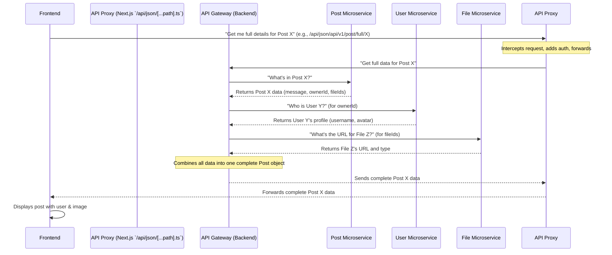

# Chapter 6: API Communication & Data Models

Welcome back, game developers! In [Chapter 5: Backend Microservices](05_backend_microservices_.md), we peeled back the curtain to reveal that `Game_Devs_Connect` isn't one giant program, but a collection of many small, independent "departments" (microservices), each with its own job. You learned *what* these services are.

Now, a big question remains: **How do these independent departments actually talk to each other and to the [Frontend Web Application](01_frontend_web_application_.md)?** They are separate programs, possibly running on different computers! How do they send information back and forth and make sure everyone understands what's being said?

That's where **API Communication & Data Models** come in!

### What Problem Do They Solve?

Imagine you're trying to communicate with someone who speaks a different language. You'd need a translator and a dictionary, right?

In `Game_Devs_Connect`, our Frontend speaks one "language" (Next.js/TypeScript), and our Backend Microservices speak another (".NET"). They also live in different "countries" (different servers). For them to work together seamlessly, they need:
1.  A clear way to **ask for information or send commands** (this is **API Communication**).
2.  A shared understanding of **what that information looks like** (these are **Data Models** or **Interfaces**).

**Our Central Use Case:** When you **view a post on the `Game_Devs_Connect` homepage**, it doesn't just show the message. It also displays the **username** of the person who posted it and any **images** attached. How does our Frontend get *all* this information, which comes from different Backend services (Post, User, File)?

### What are API Communication and Data Models?

Think of it like this:

*   **API (Application Programming Interface):** This is like a **menu at a restaurant**. It lists all the dishes you can order (requests) and describes what each dish will contain when it arrives (responses). It's a set of rules and definitions that allow different software pieces to interact.
*   **API Communication:** This is the **actual act of ordering food** from the menu (sending a request) and the waiter bringing you the food (receiving a response). It's the back-and-forth conversation.
*   **Data Models (Interfaces):** This is like the **recipe for each dish** on the menu. It defines exactly what ingredients go into a "Post" (e.g., message, owner ID) or a "User" (e.g., username, avatar) and in what specific structure. They act like a **shared dictionary or contract** so both sides (Frontend and Backend) agree on the exact format of the information being sent and received.

### How `Game_Devs_Connect` Uses Them

In `Game_Devs_Connect`, the Frontend doesn't directly connect to *every single* microservice. Instead, it uses a smart middleman: the **API Gateway** (which also acts as an "internal proxy" for the Frontend).

1.  The Frontend sends a request (e.g., "Get me post #123") to the **API Gateway**.
2.  The API Gateway acts like a **universal translator** or a **smart receptionist**. It knows *which* specific Backend microservice (e.g., the `Post` service, the `User` service, the `File` service) handles that kind of request.
3.  It then routes the request to the correct Backend microservice.
4.  The Backend microservice processes the request and sends back the data.
5.  The API Gateway receives the data, possibly combines it with data from other microservices (like user info and file info for a post), and sends it back to the Frontend.

Throughout this entire conversation, both the Frontend and Backend use **Data Models (Interfaces)** to ensure they are speaking the exact same language and expect the data in the same "shape."

### Solving Our Use Case: Viewing a Full Post

Let's revisit our use case: you want to view a post with its message, owner's username, and attached images.

Here's how the Frontend asks for this information:

```typescript
// GameDevsConnect.Frontend/GameDevsConnect.Frontend.Web/services/post_service.ts
// (Simplified for clarity)

import axios from "axios"
import { getUrl } from "@/lib/api" // Helper to build backend URL

const url = getUrl('json','post') // Points to our Post Management Backend

export const getPostAsync = async (id:string) =>
{
    // Make a GET request to the Backend's Post API for full post details
    // Example URL: YOUR_BACKEND_URL/api/json/api/v1/post/full/123
    return await axios.get(`${url}/full/${id}`).then(x => x.data)
}
```
**What this code does:**
*   `getPostAsync` is a function in our Frontend that acts like asking the waiter for "Post #123, with all its details."
*   `axios.get` is the tool that sends this request over the internet.
*   The `url` variable is constructed by `getUrl`, which basically creates the full address for the API Gateway's "Post" endpoint.

Now, let's see how `getUrl` helps construct that address:

```typescript
// GameDevsConnect.Frontend/GameDevsConnect.Frontend.Web/lib/api.ts

export const getUrl = (methode:string, endpoint:string) => 
  // Combines parts to form a full URL like:
  // YOUR_PUBLIC_URL/api/json/api/v1/post
  `${process.env.NEXT_PUBLIC_URL}/api/${methode}/api/v1/${endpoint}`;
```
**What this code does:** `getUrl` is a helper that builds the full web address (`URL`) for the specific Backend service we want to talk to. For example, `getUrl('json', 'post')` would create a URL that points to the API Gateway's `post` service, ready to handle `json` data.

### What Happens "Under the Hood"? (The API Proxy in Action)

When the Frontend calls `getPostAsync(id)`, here's the journey of that request:


**Explanation:**
1.  **Frontend to API Proxy:** When your Frontend code calls `axios.get(url)`, the request first hits a special part of our Frontend application: the API Proxy. This proxy is defined in `pages/api/json/[...path].ts`.
2.  **API Proxy's Role:** This file acts as a gatekeeper and forwarder. It takes the incoming request, adds necessary security tokens (from `axios_config.ts`), and then **forwards** the request to the *actual* Backend API Gateway. This makes it so the Frontend never needs to know the exact address of each Backend microservice; it just talks to its own internal proxy.
    ```typescript
    // GameDevsConnect.Frontend/GameDevsConnect.Frontend.Web/pages/api/json/[...path].ts
    // (Simplified for clarity)

    import { getAxiosInstance } from "@/lib/axios_config"; // For secure communication
    import type { NextApiRequest, NextApiResponse } from "next";

    export default async function handler(req: NextApiRequest, res: NextApiResponse) 
    {
        let paths = req.query.path as string[]; // Extracts the part like 'api/v1/post/full/123'
        let backendUrl = `${process.env.BACKEND_URL}/${paths.join('/')}` // Reconstructs full backend URL
            
        let response = undefined;

        switch(req.method) // Checks if it's GET, POST, PUT, DELETE
        {
            case "GET":
                // Forwards the GET request to the actual backend URL
                response =  await (await getAxiosInstance()).get(backendUrl).then(x => x.data)
                break;
            // ... cases for POST, PUT, DELETE ...
        }
        res.status(200).json(response); // Sends backend response back to frontend
    }
    ```
    **What this code does:** This `handler` function in the API Proxy receives the request from your browser. It then reconstructs the full URL for the *real* Backend API Gateway (e.g., `https://my-backend-api.com/api/v1/post/full/123`), uses a secure `axiosInstance` to forward that request, and then sends whatever response it gets back directly to your browser.
3.  **API Proxy to API Gateway (Backend):** The request now goes from the Frontend's internal proxy to the actual Backend's API Gateway.
4.  **API Gateway (Backend) Orchestration:** As seen in [Chapter 5](05_backend_microservices_.md), this central Gateway knows to split up the request and ask the `Post`, `User`, and `File` Microservices for their respective pieces of information. It then combines all these parts into a single, complete `Post` object.
5.  **Response Back:** The combined response travels back through the Backend API Gateway, then through the Frontend's API Proxy, and finally reaches your Frontend application, which then updates what you see on the screen.

### Data Models: The Shared Dictionary

Throughout this entire dance, `Data Models` (often called `interfaces` in TypeScript) are the unsung heroes. They are like **blueprints or contracts** that both the Frontend and Backend agree upon.

Imagine a "Post" has these parts: a unique ID, a message, and who wrote it. Both Frontend and Backend need to agree on that exact structure.

Here are some examples of these "contracts" from our project:

*   **`IPost` (Blueprint for a Post):**
    ```typescript
    // GameDevsConnect.Frontend/GameDevsConnect.Frontend.Web/interfaces/post.ts

    export interface IPost
    {
        id:string;           // Unique ID for this post (e.g., "abc-123")
        parentId:string | null; // If it's a comment, ID of the original post
        message:string;      // The text content of the post
        ownerId:string;      // ID of the user who created the post
        // ... other details like created date, quest link, etc.
    }
    ```
    **Explanation:** When the Frontend asks for a `Post`, it expects an object that *must* have an `id`, `parentId`, `message`, and `ownerId` (among others), all of which are `string`s (text) or `null`. If the Backend sends something different, the Frontend will get confused!

*   **`IFile` (Blueprint for a File):**
    ```typescript
    // GameDevsConnect.Frontend/GameDevsConnect.Frontend.Web/interfaces/file.ts

    export interface IFile
    {
        id:string;  // Unique ID for the file (e.g., "def-456")
        url:string; // Where to find the actual file (e.g., image URL)
        type:string; // Type of file (e.g., "image/png")
        size:number; // Size of the file in bytes
        ownerId:string; // Who uploaded it
        // ... other details
    }
    ```
    **Explanation:** Similarly, for any attached files, the Frontend expects an `IFile` object to have these specific properties.

*   **`IUpsertPostRequest` (Blueprint for sending a New Post):**
    ```typescript
    // GameDevsConnect.Frontend/GameDevsConnect.Frontend.Web/interfaces/requests/post/api_add_post_request.ts

    import { IPost } from "@/interfaces/post";

    export interface IUpsertPostRequest
    {
        post:IPost;      // The actual post data (following IPost blueprint)
        tags:string[];   // Any keywords (simplified from ITag[])
        fileIds:string[] // A list of IDs for any attached files/images
    }
    ```
    **Explanation:** When the Frontend *sends* a new post, it bundles all the information into an `IUpsertPostRequest` object. This request *must* contain a `post` object (following the `IPost` blueprint), a list of `tags` (text), and a list of `fileIds` (text). The Backend knows exactly what to expect when it receives this "package."

*   **`IAPIResponse` (Blueprint for all Responses):**
    ```typescript
    // GameDevsConnect.Frontend/GameDevsConnect.Frontend.Web/interfaces/responses/api_response.ts

    export interface IAPIResponse
    {
        message:string | null;    // A general message (e.g., "Success" or "Error")
        status:boolean;           // True if successful, false if not
        validateErrors:string[] | null; // Any specific error messages
    }
    ```
    **Explanation:** Almost every time the Frontend talks to the Backend, it expects a response that follows this `IAPIResponse` blueprint. This way, the Frontend can always check `response.status` to know if the operation was successful, and `response.message` or `response.validateErrors` to understand what went wrong.

These `interfaces` are crucial because they enforce a consistent way of exchanging data. Without them, it would be like two people trying to assemble IKEA furniture without the instruction manual – chaos!

### Conclusion

In this chapter, we've explored the fundamental concepts of **API Communication & Data Models** that enable different parts of `Game_Devs_Connect` to speak the same language. You learned that **APIs** are like menus for interaction, **API Communication** is the actual exchange of requests and responses, and **Data Models (Interfaces)** are the crucial blueprints that define the exact structure of data, ensuring both Frontend and Backend understand each other.

We saw how the Frontend uses its internal **API Proxy** (`pages/api/json/[...path].ts`) as a smart middleman to talk to the Backend's **API Gateway**, which then orchestrates communication between all the specialized microservices. This system is like a universal translator combined with a shared dictionary, making complex interactions seamless.

Now that we understand how these pieces communicate, how do we make sure they are reliably built, tested, and deployed so everyone can use them? That's what we'll explore in the next chapter!

[Next Chapter: Containerization & CI/CD](07_containerization___ci_cd_.md)

---