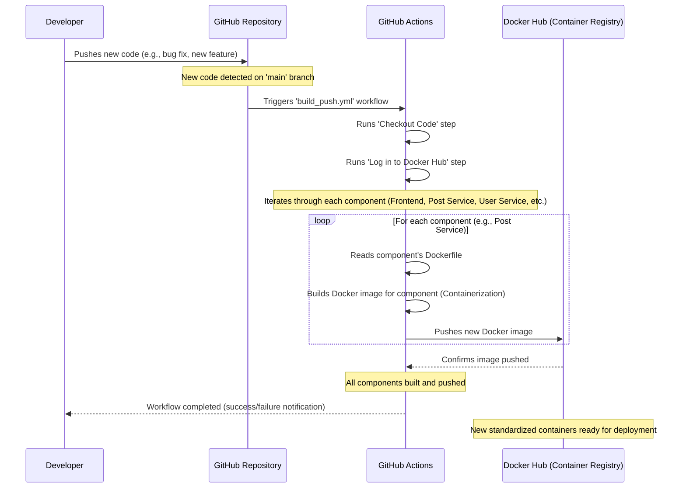

# Chapter 7: Containerization & CI/CD

Welcome back, game developers! In [Chapter 6: API Communication & Data Models](06_api_communication___data_models_.md), we learned how the many independent parts of `Game_Devs_Connect` (like our Frontend and various Backend Microservices) talk to each other using well-defined rules and data formats. This makes our system modular and organized.

But now, a new challenge emerges: How do we actually **run** all these separate parts? And, once they are running, how do we make sure that **every time we make a change or fix a bug**, these updates get to you, our users, quickly and reliably, without us having to do a lot of complicated manual steps?

That's where **Containerization & CI/CD** come in!

### What Problem Do They Solve?

Imagine you're building a LEGO spaceship. You design the cockpit, the wings, and the engines separately. But then you need to actually *assemble* them and make sure they *work together* perfectly every time you build a new one.

Software development faces similar problems:
*   **"It Works On My Machine!":** A common problem is when code works perfectly on a developer's computer but breaks when moved to a server. This is often due to missing software, different settings, or environmental differences.
*   **Slow & Error-Prone Updates:** Manually building each part of `Game_Devs_Connect` (Frontend, User Service, Post Service, etc.), packaging them, and then deploying them to servers is slow, boring, and very easy to mess up. What if you forget a step or deploy an old version?

**Our Central Use Case:** How does `Game_Devs_Connect` ensure that whenever a developer writes new code for a feature (like a new "favorite" button for posts), that feature is **reliably packaged**, **automatically tested**, and then **quickly delivered** to the live website for everyone to use, without manual errors?

### What is Containerization (Docker)?

Think of **Containerization** like packing each part of your LEGO spaceship into its own **standardized, sealed shipping crate**. This crate isn't just the part itself; it also contains all the special tools, instructions, and materials needed to build and operate *that specific part*, no matter where the crate is shipped.

*   **Docker:** This is the most popular tool for creating these "shipping crates," which we call **containers**.
*   **What a Container Does:** A Docker container bundles your application's code, plus all the things it needs to run (like programming languages, libraries, configuration files). This means it will **run exactly the same way** on a developer's laptop, a testing server, or the final live server.
*   **Benefits:**
    *   **Portability:** Works the same everywhere.
    *   **Consistency:** Eliminates "it works on my machine" problems.
    *   **Isolation:** Each part runs in its own separate "box," so they don't interfere with each other.

In [Chapter 1: Frontend Web Application](01_frontend_web_application_.md) and [Chapter 5: Backend Microservices](05_backend_microservices_.md), we briefly saw `Dockerfile`s. These are the **recipes** for building our containers. Each microservice and our Frontend has its own `Dockerfile`.

Here's a simplified `Dockerfile` for our Frontend, which tells Docker how to build its "crate":

```dockerfile
# GameDevsConnect.Frontend/GameDevsConnect.Frontend.Web/Dockerfile

# Step 1: Prepare for building (like setting up a workbench)
FROM node:23-alpine AS base 
WORKDIR /app
COPY package.json . 
COPY package-lock.json .
RUN npm ci # Install project dependencies
COPY . .    # Copy all source code
RUN npm run build # Prepare the application for deployment

# Step 2: Create the final, smaller package (like putting the finished product into a neat box)
FROM node:23-alpine AS final
WORKDIR /app
# Copy only the absolutely necessary files from the "base" step
COPY --from=base /app/.next .next
COPY --from=base /app/node_modules ./node_modules
# ... other minimal files ...
CMD ["npm", "start"] # Command to start the application when the container runs
```
**What this code does:** This `Dockerfile` has two main stages:
1.  **`base` stage:** It sets up an environment (`FROM node:23-alpine`), copies all the Frontend code, installs its dependencies (`npm ci`), and then "builds" the Next.js application into ready-to-serve files (`npm run build`).
2.  **`final` stage:** It creates a *much smaller* new environment. It then copies *only* the essential, already-built files from the `base` stage. This keeps our container lightweight. Finally, `CMD ["npm", "start"]` tells Docker how to run our Frontend application once the container is launched.

This same idea applies to every Backend Microservice. Each one has its own `Dockerfile` to create its own standardized container.

### What is CI/CD?

**CI/CD** stands for **C**ontinuous **I**ntegration and **C**ontinuous **D**eployment (or Delivery). It's like having an **automated factory line** that takes your new code, builds it, tests it, and then ships it, all without human intervention.

*   **CI (Continuous Integration):**
    *   **Goal:** To automatically build and test your code every time a change is made.
    *   **Analogy:** Imagine a smart quality control system. As soon as a LEGO piece is designed, this system automatically checks if it fits with other pieces, runs stress tests, and makes sure there are no obvious cracks.
    *   **Benefit:** Catches bugs early, ensures new code works with existing code.

*   **CD (Continuous Deployment/Delivery):**
    *   **Goal:** To automatically release new versions of your software to users.
    *   **Analogy:** Once the quality control system approves a piece, it's automatically packaged and shipped to the assembly line, or even directly to customers.
    *   **Benefit:** Faster updates, fewer manual errors, consistent releases.

*   **GitHub Actions:** This is the specific tool `Game_Devs_Connect` uses for its CI/CD pipeline. It allows us to automate tasks directly within our GitHub project. When you push new code to GitHub, GitHub Actions can automatically kick off our "factory line."

### How `Game_Devs_Connect` Uses Containerization & CI/CD (Solving the Use Case)

Let's follow our central use case: A developer fixes a bug or adds a new feature to the Post Microservice.

Here's the automated journey of that new code:

1.  **Developer Writes Code:** A developer works on the `Post` Microservice code on their computer.
2.  **Code Push to GitHub:** When the new code is ready, the developer pushes it to the `main` branch of our `Game_Devs_Connect` project on GitHub.
3.  **GitHub Actions Kicks Off (CI):** GitHub detects the new code on the `main` branch. This automatically triggers our CI/CD pipeline, defined in a file called `build_push.yml`.
4.  **Automated Building & Testing:**
    *   GitHub Actions reads the `build_push.yml` recipe.
    *   For *every single part* of `Game_Devs_Connect` (Frontend, User Microservice, Post Microservice, etc.), it finds its `Dockerfile`.
    *   It then uses **Docker** to build a fresh, standardized container image for each part, ensuring they are correctly packaged with all their dependencies.
    *   (In a real-world scenario, automated tests would run here too, but they are simplified for this tutorial.)
5.  **Container Pushing to Docker Hub:** Once built, these new container images (e.g., `gamedevsconnect_backend_api_post:latest`) are automatically "pushed" (uploaded) to **Docker Hub**, which is a central online storage place for Docker container images. Think of it as a warehouse for our standardized shipping crates.
6.  **Ready for Deployment (CD):** The new container images are now safely stored in Docker Hub, ready to be picked up and deployed to our live servers. This final deployment step is usually handled by another automated process (like Terraform, which we'll cover in the next chapter!).

#### The Automation in Action: `build_push.yml`

Our automated factory line is primarily set up in the `.github/workflows/build_push.yml` file.

```yaml
# .github/workflows/build_push.yml

name: Build_and_Push # Name of our automated workflow

on:
  push: # This workflow runs automatically when code is PUSHED
    branches: [main] # Specifically when code is pushed to the 'main' branch
    paths-ignore:
      - .github/** # Ignore changes to workflow files themselves

env:
  APP_NAME: 'GameDevsConnect'
  APP_NAME_LOWER: 'gamedevsconnect'
    
jobs:
  build-stage: # We have one job called 'build-stage'
    runs-on: ubuntu-latest # It runs on a fresh Ubuntu server provided by GitHub

    strategy:
      matrix: # This tells GitHub Actions to run the following steps multiple times
        include: # Once for EACH of our components!
          - path: Backend.API.Azure # Component 1
            tag: backend_api_azure
            context: ./
          - path: Backend.API.File # Component 2
            tag: backend_api_file
            context: ./
          # ... (many more backend services listed here, each with its own 'path' and 'tag') ...
          - path: Frontend/GameDevsConnect.Frontend.Web # Our Frontend!
            tag: frontend
            context: ./GameDevsConnect.Frontend/GameDevsConnect.Frontend.Web

    steps:
      - name: Checkout Code # Step 1: Get the latest code from GitHub
        uses: actions/checkout@v4
      
      - name: Log in to Docker Hub # Step 2: Log into our Docker image warehouse
        uses: docker/login-action@v3
        with:
          username: ${{secrets.DOCKER_USERNAME}}
          password: ${{secrets.DOCKER_PASSWORD}}

      - name: Build and Push # Step 3: This is the core step!
        uses: docker/build-push-action@v5
        with:
          context: ${{matrix.context}} # Where to find the Dockerfile for this component
          file: ./${{env.APP_NAME}}.${{matrix.path}}/Dockerfile # The specific Dockerfile path
          push: true # Yes, push the built image to Docker Hub
          tags: ${{secrets.DOCKER_USERNAME}}/${{env.APP_NAME_LOWER}}_${{matrix.tag}}:latest # The name for the image (e.g., gamedevsconnect/gamedevsconnect_frontend:latest)
```
**What this code does:**
*   The `on: push` section tells GitHub: "Start this whole process whenever someone pushes code to the `main` branch."
*   The `strategy.matrix.include` is very powerful: It says "Run the following `steps` for *each* of these items." Each item is one of our Backend Microservices or the Frontend. This means the build and push process happens automatically for **every single part** of `Game_Devs_Connect` that needs to be containerized!
*   The `Build and Push` step uses a special `docker/build-push-action` that automatically finds the correct `Dockerfile` for each `path` (like `GameDevsConnect.Frontend/GameDevsConnect.Frontend.Web/Dockerfile`), builds the Docker image, and then uploads (`push: true`) it to Docker Hub with a specific `tag` (name).

This file completely automates what you might otherwise do manually using scripts like `Docker/build.sh` and `Docker/push.sh`.

#### Manual Equivalents (Automated by CI/CD)

The `Docker/build.sh` script is what you would run manually to build all images locally:

```bash
# Part of: Docker/build.sh

# Gateway
echo -e '>>>> Building Gateway'
docker build --no-cache -f ../GameDevsConnect.Backend.API.Gateway/Dockerfile -t benexdrake012/gamedevsconnect_backend_api_gateway ../
echo ''

# Azure
echo -e '>>>> Building Azure'
echo ''
docker build --no-cache -f ../GameDevsConnect.Backend.API.Azure/Dockerfile -t benexdrake012/gamedevsconnect_backend_api_azure ../
echo ''

# ... (similar blocks for all other services and Frontend) ...
```
**What this code does:** This script simply runs the `docker build` command repeatedly, once for each microservice and the Frontend. The `-f` flag points to the `Dockerfile` for that specific component, and `-t` gives the resulting image a name. Our `build_push.yml` in GitHub Actions essentially automates this exact process across all components.

And `Docker/push.sh` is what you would run manually to push them to Docker Hub:

```bash
# Part of: Docker/push.sh

# Gateway
echo -e '>>>> Pushing Gateway'
echo ''
docker push benexdrake012/gamedevsconnect_backend_api_gateway
echo ''

# Azure
echo -e '>>>> Pushing Azure'
echo ''
docker push benexdrake012/gamedevsconnect_backend_api_azure
echo ''

# ... (similar blocks for all other services and Frontend) ...
```
**What this code does:** This script simply runs the `docker push` command repeatedly, sending each locally built image to Docker Hub. Again, our GitHub Actions workflow automates this for us.

### What Happens "Under the Hood"? (The Automated Pipeline)

Let's visualize the entire automated process, from a developer's change to a new container being ready for deployment:


This diagram shows how `Game_Devs_Connect` uses a fully automated pipeline to turn new code changes into ready-to-deploy containers.

### Conclusion

In this chapter, we've explored the power of **Containerization (with Docker)** and **CI/CD (with GitHub Actions)**. You now understand how Docker packages each part of `Game_Devs_Connect` into standardized, portable "containers," ensuring they run consistently everywhere. We also saw how **Continuous Integration** and **Continuous Deployment** automate the entire process from a code change to having new container images ready for release, eliminating manual errors and speeding up updates.

This automated factory line ensures that our "shipping crates" (containers) are always up-to-date and consistently built. But how do we actually *take* these crates from the Docker Hub warehouse and get them running on servers for everyone to use? That's the exciting topic of our next chapter!

[Next Chapter: Infrastructure Provisioning (Terraform)](08_infrastructure_provisioning__terraform__.md)

---