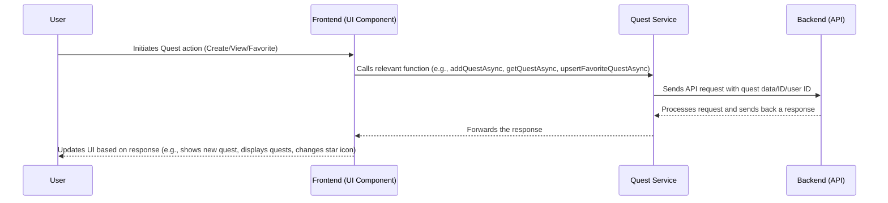

# Chapter 4: Quest System

Welcome back, game developers! In [Chapter 1: Frontend Web Application](01_frontend_web_application_.md), you learned about what you see and interact with. In [Chapter 2: Authentication System](02_authentication_system_.md), you discovered how `Game_Devs_Connect` knows who you are. And in [Chapter 3: Post & Content Management](03_post___content_management_.md), we explored how you can share your projects and thoughts.

But `Game_Devs_Connect` isn't just about sharing. It's also about **action**! What if you want to find a specific task to contribute to a project, or challenge others with a game development riddle? This is where the **Quest System** comes in!

### What Problem Does It Solve?

Imagine you're a game developer looking for a fun challenge, or maybe you need help with a specific task in your project. How do you find or offer these opportunities in a structured way? Just posting a message might get lost in the feed.

**Our Central Use Case:** You want to **create a new quest** asking for help with game design, then **browse a list of available quests** from others, and **"favorite" one** that looks interesting so you can easily find it later.

### What is a Quest System?

Think of the Quest System as a **virtual bounty board** or a **mission hub** within `Game_Devs_Connect`. It's a place where:
*   Users can **post new missions or challenges** (called "quests") for others to tackle.
*   Quests can have details like a `title`, `description`, and `difficulty`.
*   Users can **browse a list** of all available quests.
*   Users can **mark quests as "favorited"** to keep track of ones they like.
*   This adds a fun, gamified element, encouraging everyone to work towards specific goals and contribute to the community.

It's how `Game_Devs_Connect` organizes actionable tasks beyond simple posts!

### How to Use the Quest System (The Frontend Experience)

When you're logged into `Game_Devs_Connect`, you'll find sections dedicated to quests where you can interact with them.

#### 1. Creating a New Quest

You'll typically find an "Add Quest" section where you can type in the details of your challenge.

```typescript
// GameDevsConnect.Frontend/GameDevsConnect.Frontend.Web/components/quest/add_quest.tsx

import { IQuest } from '@/interfaces/quest';
import { addQuestAsync } from '@/services/quest_service'; // We'll talk about this soon!
import { useState } from 'react';

export default function AddQuest({ownerId, setQuests}:{ownerId:string, setQuests:Function})
{
    const [title, setTitle] = useState<string>('');
    const [difficulty, setDifficulty] = useState<number>(1);
    const [description, setDescription] = useState<string>('');
    
    // When the user clicks the "ADD" button
    const onSendHandler = async () =>
    {
        // 1. Create a Quest object with the entered details
        const newQuest:IQuest = {id:'', title, description, difficulty, postId:'', ownerId}; 
        
        // 2. Send the new quest data to our Backend
        const response = await addQuestAsync(newQuest);
        
        if (response.status) {
            // If successful, update the list of quests shown on the screen
            setQuests((prev:IQuest[]) => [...prev, newQuest]);
            // Clear the input fields
            setTitle('');
            setDifficulty(1);
            setDescription('');
        }
    }

    return (
        <div>
            <div>
                <input type="text" value={title} onChange={(e) => setTitle(e.target.value)} placeholder='Quest Title'/>
                <select value={difficulty} onChange={(e) => setDifficulty(parseInt(e.target.value))}>
                    <option value="1">1</option> <option value="2">2</option> <option value="3">3</option>
                </select>
                <div onClick={() => onSendHandler()}>ADD</div> {/* Click this to send! */}
            </div>
            <div>
                <textarea value={description} onChange={(e) => setDescription(e.target.value)} placeholder='Quest Description'></textarea>
            </div>
        </div>
    )
}
```
**What this code does:**
*   It collects the `title`, `difficulty`, and `description` from the user's input.
*   When the "ADD" button is clicked, it creates an `IQuest` object (a blueprint for a quest).
*   Then, it uses `addQuestAsync` (a function that talks to our [Backend Microservices](05_backend_microservices_.md)) to send this new quest to be saved.
*   If the quest is successfully added, the screen updates to show the new quest, and the input fields are cleared.

#### 2. Viewing Quests (The Infinite Scroll Board)

Just like posts, quests are displayed in a scrolling list so you can see many challenges at once.

```typescript
// GameDevsConnect.Frontend/GameDevsConnect.Frontend.Web/components/quest/infinite_scroll_quests.tsx

import { getFavoritedQuestIdsAsync } from "@/services/quest_service"; // To get quest IDs
import { useEffect, useState } from "react";
import { useInView } from "react-intersection-observer"; // Checks if element is visible
import ShowQuests from "./show_quests"; // Component to display quests

export default function InfiniteScrollQuests({initialIds, search, userId}: {initialIds:string[], search:string, userId:string})
{
    const [ids, setIds] = useState<string[]>(initialIds) // List of quest IDs
    const [page, setPage] = useState<number>(1); // Current page for loading more
    const [ref, inView] = useInView(); // 'ref' watches an element, 'inView' is true if it's visible

    const loadMoreIds = async () =>
    {
        const next = page + 1;
        // Ask the backend for more FAVORITED quest IDs for the current user
        const response = await getFavoritedQuestIdsAsync(userId, next, 5, search);
        
        if(response.status && response.ids.length > 0)
        {
            setPage(next) // Update the page number
            setIds(prev => [...[...new Set([...prev, ...response.ids])]]) // Add new IDs
        }
    }
    
    useEffect(() => {
        // When the 'ref' element (our "LOADING..." text) comes into view, load more IDs
        if(inView)
            loadMoreIds();
    }, [inView]) // This effect runs whenever 'inView' changes

    return (
        <div>
            <ShowQuests ids={ids} /> {/* This component displays the actual quests */}
            <div ref={ref}> {/* This div is watched by 'useInView' */}
                LOADING ...
            </div>
        </div>
    )
}
```
**What this code does:**
*   Similar to the post feed, `InfiniteScrollQuests` uses `useInView()` to detect when you scroll near the bottom.
*   When you do, `loadMoreIds()` is called, which then uses `getFavoritedQuestIdsAsync` to ask our [Backend Microservices](05_backend_microservices_.md) for *more* quest IDs that you've marked as a favorite.
*   These new IDs are added to the list, and the `ShowQuests` component updates to display them, creating a continuous scroll.

Once `ShowQuests` receives the IDs, it passes each `id` to `ShowQuest`, which then fetches the full details:

```typescript
// GameDevsConnect.Frontend/GameDevsConnect.Frontend.Web/components/quest/show_quest.tsx

import { getQuestAsync } from '@/services/quest_service'; // To get full quest data
import { useEffect, useState } from 'react';
import PreviewQuest from './preview_quest'; // Component to display one quest
import { useSession } from 'next-auth/react'; // To get current user ID
import { IUser } from '@/interfaces/user';

export default function ShowQuest({id, index}:{id:string, index:number})
{
    const [response, setResponse] = useState<any>(null!); // Stores all quest data
    const {data:session} = useSession(); // Get logged-in user's session
    const user = session?.user as IUser; // Extract user data

    useEffect(() => {
        const get = async () =>
        {
            // Ask the backend for all details of this specific quest ID
            // We also send the user ID to check if this quest is favorited
            const r = await getQuestAsync(id, user.id); 
            
            if(r.status)
                setResponse(r); // Store the full response
        }
        get(); // Fetch quest data when the component loads
    },[id, user.id]) // Re-run if the quest 'id' or user 'id' changes

    if(response)
        return (
            // Display the quest using the PreviewQuest component
            <PreviewQuest quest={response.quest} favorited={response.favoritedQuest} preview={false} onQuestDeleteHandler={null} index={index}/>
        )
    else
        return <div>LOADING...</div>
}
```
**What this code does:**
*   When a `ShowQuest` component loads, it fetches the full details for a specific `quest.id` from our [Backend Microservices](05_backend_microservices_.md) using `getQuestAsync`.
*   Crucially, it also sends the `userId` so the Backend can tell us if *this specific user* has favorited this quest.
*   Once the data is received, `PreviewQuest` takes over to render the quest's title, description, difficulty, and the appropriate star icon (filled or empty).

#### 3. Favoriting a Quest

A key feature is the ability to mark quests you're interested in.

```typescript
// GameDevsConnect.Frontend/GameDevsConnect.Frontend.Web/components/quest/preview_quest.tsx

import { IQuest } from '@/interfaces/quest'
import { IUser } from '@/interfaces/user';
import { upsertFavoriteQuestAsync } from '@/services/quest_service'; // To favorite/unfavorite
import styles from '@/styles/quest/quest.module.css'
import { useSession } from 'next-auth/react';
import { useState } from 'react';

export default function PreviewQuest({quest, favorited, onQuestDeleteHandler, preview, index}:{quest:IQuest, favorited:boolean, onQuestDeleteHandler:Function | null, preview:boolean, index:number})
{
    const [favorite, setFavorite] = useState<boolean>(favorited) // Tracks if currently favorited
    const {data:session} = useSession();
    const user = session?.user as IUser;

    const onFavoriteHandler = async (e: React.MouseEvent) =>
    {
        e.stopPropagation(); // Stop click from affecting parent elements
        setFavorite(prev => !prev); // Optimistically update the star icon
        
        // Tell our backend to add or remove this quest from user's favorites
        const response = await upsertFavoriteQuestAsync({questId:quest.id, userId:user.id});
        // console.log(response); // For debugging
    }

    return (
        <div className={styles.main}>
            <article>
                <div className={styles.main_content}> {/* Quest details like title, description */}
                    <p>{quest?.title}</p> <p>{quest.difficulty}</p>
                    <p>{quest?.description}</p>
                </div>
                {!preview && ( // Only show favorite button if not in preview mode
                    <div className={styles.buttons}>
                        <div className={styles.button} onClick={onFavoriteHandler}>
                            {/* Display a solid star if favorited, outline if not */}
                            <i className={`fa-${favorite ? 'solid':'regular'} fa-star`}></i>
                        </div>
                    </div>
                )}
            </article>
        </div>
    )
}
```
**What this code does:**
*   The `PreviewQuest` component displays a star icon. Its appearance (`solid` or `regular`) depends on the `favorite` state.
*   When the user clicks the star, `onFavoriteHandler()` is called.
*   It immediately flips the `favorite` state (so the star changes instantly, making the app feel fast).
*   Then, it calls `upsertFavoriteQuestAsync` to send a request to our [Backend Microservices](05_backend_microservices_.md) to actually add or remove this quest from the user's favorites in the database.

### What Happens "Under the Hood"?

Let's trace how the Frontend interacts with the Backend for quest operations.



This diagram shows that the `Quest Service` acts as the messenger between your screen (Frontend) and the brain of our application (Backend).

#### The Services: Talking to the Backend (`quest_service.ts`)

All the interactions with quests happen through `quest_service.ts`. It contains functions that talk to the [Backend Microservices](05_backend_microservices_.md) where all the quest data is stored and managed.

```typescript
// GameDevsConnect.Frontend/GameDevsConnect.Frontend.Web/services/quest_service.ts

import { IQuest } from "@/interfaces/quest";
import { IAPIUpsertFavoriteRequest } from "@/interfaces/requests/quest/api_upsert_favorite_request";
import { IAPIResponse } from "@/interfaces/responses/api_response";
import { IAPIQuestIdsResponse } from "@/interfaces/responses/quest/api_quest_ids_response";
import { IAPIQuestResponse } from "@/interfaces/responses/quest/api_quest_response";
import { getUrl } from "@/lib/api" // Helper to build backend URL

import axios from "axios"; // Tool to make web requests

const url = getUrl('json','quest') // This creates the base URL for our Quest API

export const getQuestAsync = async (id:string, userId:string='') =>
{
    // Requests full details of a specific quest (and if it's favorited by userId)
    return await axios.get<IAPIQuestResponse>(`${url}/${id}?userId=${userId}`).then(x => x.data)
}

export const getFavoritedQuestIdsAsync = async (userId:string, page:number=1, pageSize:number=10, searchTerm:string='') =>
{
    // Requests a list of IDs for quests that the given userId has favorited
    return await axios.get<IAPIQuestIdsResponse>(`${url}/favorites?page=${page}&pageSize=${pageSize}&userId=${userId}&searchTerm=${searchTerm}`).then(x => x.data)
}

export const addQuestAsync = async (quest:IQuest) =>
{
    // Sends new quest data to the backend to create a new quest
    return await axios.post<IAPIResponse>(`${url}/add`, quest).then(x => x.data)
}

export const upsertFavoriteQuestAsync = async (upsertFavorite:IAPIUpsertFavoriteRequest) =>
{
    // Sends a request to toggle (add/remove) a quest from a user's favorites
    return await axios.post<IAPIResponse>(`${url}/favorite`, upsertFavorite).then(x => x.data)
}
```
**Explanation:**
*   `axios` is a common tool used to send and receive data over the internet.
*   The `url` variable points to the specific part of our [Backend Microservices](05_backend_microservices_.md) that handles quests.
*   Each function (`getQuestAsync`, `getFavoritedQuestIdsAsync`, `addQuestAsync`, `upsertFavoriteQuestAsync`) sends a different type of request (like "GET" for getting data, "POST" for sending new data) to the Backend. The Backend then processes these requests and sends back a response.

#### Data Structures for Quests and Requests

To ensure our Frontend and Backend speak the same language, we define specific "blueprints" for the data.

*   **`IQuest` (What a Quest Is):**
    This interface defines the essential information for any quest in our system.

    ```typescript
    // GameDevsConnect.Frontend/GameDevsConnect.Frontend.Web/interfaces/quest.ts

    export interface IQuest
    {
        id:string; // Unique ID for this quest
        postId:string; // If related to a post, the ID of that post
        ownerId:string; // ID of the user who created this quest
        difficulty:number; // How hard is this quest (e.g., 1, 2, or 3)
        title:string; // The name of the quest
        description:string; // Detailed explanation of the quest
    }
    ```
    **Explanation:** This blueprint tells us all the pieces of information that make up a `Game_Devs_Connect` quest. For example, when you create a quest, all these fields need to be filled in (even if some, like `id` or `postId`, are initially empty and filled by the Backend).

*   **`IAPIUpsertFavoriteRequest` (How We Send Favorite Data):**
    When you favorite or unfavorite a quest, we send a small package of data.

    ```typescript
    // GameDevsConnect.Frontend/GameDevsConnect.Frontend.Web/interfaces/requests/quest/api_upsert_favorite_request.ts

    export interface IAPIUpsertFavoriteRequest
    {
        questId:string; // The ID of the quest being favorited/unfavorited
        userId:string; // The ID of the user who is doing the favoriting
    }
    ```
    **Explanation:** This structure defines the minimum information needed by the Backend to know *which quest* a *specific user* wants to favorite or unfavorite.

### Conclusion

In this chapter, we've unlocked the **Quest System**, turning `Game_Devs_Connect` into a dynamic platform for challenges and collaboration. You now understand how to create new quests, browse existing ones through an infinite scroll, and easily mark your favorites. We explored how Frontend components like `AddQuest`, `InfiniteScrollQuests`, and `PreviewQuest` seamlessly interact with the `quest_service.ts` to manage these exciting tasks.

This system relies heavily on our Backend to store and manage all this information. Next, we'll peel back another layer and dive into the powerful **Backend Microservices** that make all this magic possible!

[Next Chapter: Backend Microservices](05_backend_microservices_.md)

---