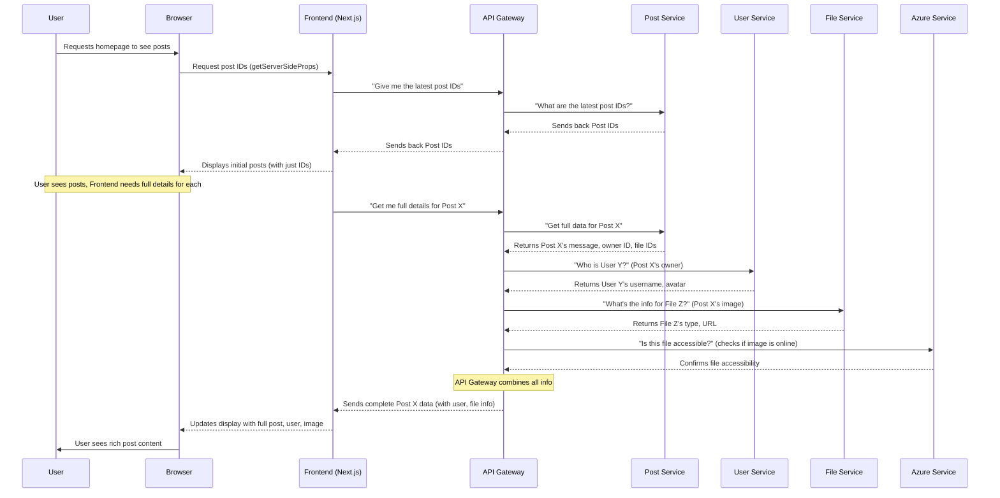

# Chapter 5: Backend Microservices

Welcome back, aspiring game developers! In our previous chapters, you've learned about the user-facing side of `Game_Devs_Connect`: the [Frontend Web Application](01_frontend_web_application_.md) that you see and interact with. We then explored the [Authentication System](02_authentication_system_.md) that keeps your account secure, the [Post & Content Management](03_post___content_management_.md) system for sharing your work, and the exciting [Quest System](04_quest_system_.md) for challenges and collaboration.

You've seen how the Frontend makes requests like "get me the latest posts" or "save this new quest." But where do these requests go? Where is all that information about users, posts, quests, and files actually stored and managed?

That's where the **Backend Microservices** come in!

### What Problem Do Backend Microservices Solve?

Imagine `Game_Devs_Connect` became incredibly popular overnight, with millions of users creating posts, favorite quests, and uploading tons of images. If all of this data and all the logic (like checking passwords, saving posts, finding quests) were handled by one giant program, it would become a huge mess!

*   **Difficulty to Change:** Even a tiny change in one part (like how posts are saved) could accidentally break something else (like how users log in).
*   **Hard to Scale:** If everyone is suddenly creating posts, but the login system isn't under much stress, you'd still have to make the *entire giant program* bigger, even the parts that don't need it. This wastes resources.
*   **Team Work:** Many developers working on one giant program can step on each other's toes.

**Our Central Use Case:** How does `Game_Devs_Connect` efficiently manage a growing number of users, posts, quests, and uploaded files, ensuring that a problem in one area (like file uploads) doesn't stop the entire website from working?

### What are Backend Microservices?

Think of `Game_Devs_Connect` as a **large, specialized company**. Instead of one person trying to do *everything* (finance, HR, marketing, sales), the company has many **small, independent departments**.

*   Each **department** is like a **Microservice**.
*   Each microservice is **responsible for one specific function**. For example:
    *   The "User Accounts Department" (User Microservice) only handles user logins, profiles, and permissions.
    *   The "Content Department" (Post Microservice) only manages posts and comments.
    *   The "Storage Department" (File Microservice) only deals with storing and retrieving uploaded images and files.
*   These "departments" are built using **.NET**, a powerful software framework.
*   They **communicate with each other** when they need information from another department (e.g., when showing a post, the Content Department asks the User Accounts Department "who posted this?").

This **modular approach** means different parts of `Game_Devs_Connect` can be developed, deployed, and scaled independently. If the "File Storage" department gets really busy, we can just make *that one department* bigger, without affecting the "User Accounts" department.

### How `Game_Devs_Connect` Uses Microservices

You've already interacted with these microservices without even knowing it!

*   When you **logged in with Discord** ([Chapter 2: Authentication System](02_authentication_system_.md)), the Frontend talked to our **User Microservice** to check or create your account.
*   When you **scrolled through posts** or **created a new one** ([Chapter 3: Post & Content Management](03_post___content_management_.md)), the Frontend talked to the **Post Microservice** to get or save that information. If you added an image, it also talked to the **File Microservice** and the **Azure Microservice** (for storing the actual picture).
*   When you **created or favorited a quest** ([Chapter 4: Quest System](04_quest_system_.md)), the Frontend talked to the **Quest Microservice**.

### What Happens "Under the Hood"?

Let's trace how these specialized departments work together when you ask for something complex, like viewing a post that includes an image and details about its owner.



This diagram shows how the **API Gateway** acts as a central receptionist. Instead of the Frontend needing to know about *every single microservice*, it just talks to the Gateway. The Gateway then knows which specialized service to ask for which piece of information (Post, User, File, Azure), gathers all the answers, and sends them back to the Frontend.

#### Specialization: One Job Per Service

The core idea of microservices is **single responsibility**. Each service is designed to do one thing and do it well.

| Microservice Name             | Primary Responsibility                              | Example Actions                       |
| :---------------------------- | :-------------------------------------------------- | :------------------------------------ |
| `GameDevsConnect.Backend.API.User`      | Managing user accounts, login IDs, profiles.        | Create user, get user profile.        |
| `GameDevsConnect.Backend.API.Post`      | Handling posts, comments, and their content.        | Add post, get post, list comments.    |
| `GameDevsConnect.Backend.API.Quest`     | Managing quests, difficulties, and user favorites.  | Create quest, favorite quest, list quests. |
| `GameDevsConnect.Backend.API.File`      | Storing metadata (details) about uploaded files.    | Register file ID, get file info.      |
| `GameDevsConnect.Backend.API.Azure`     | Interacting with Azure cloud storage for actual files. | Upload file to cloud, get file URL.   |
| `GameDevsConnect.Backend.API.Profile`   | Managing detailed user profiles (beyond basic user info). | Update bio, add skills.               |
| `GameDevsConnect.Backend.API.Project`   | Handling game projects and their details.         | Create project, add members to project. |
| `GameDevsConnect.Backend.API.Notification` | Sending notifications to users.                     | Send new comment notification.        |
| `GameDevsConnect.Backend.API.Tag`       | Managing tags/keywords for posts and projects.    | Add tag, search by tag.               |
| `GameDevsConnect.Backend.API.Gateway`   | Routing all incoming requests to the correct microservice. | "Front door" for all Frontend requests. |

As you can see, there's a microservice for almost every distinct function within `Game_Devs_Connect`!

#### Independent Deployment (Dockerfiles)

One of the biggest advantages of microservices is that each one can be updated and deployed **independently**. This is made possible by using `Dockerfile`s, which we briefly touched upon in [Chapter 1: Frontend Web Application](01_frontend_web_application_.md).

Each .NET microservice has its own `Dockerfile` that tells a tool called Docker how to package it into a self-contained unit (a "container").

Let's look at a super simplified `Dockerfile` for the `GameDevsConnect.Backend.API.User` microservice:

```dockerfile
# GameDevsConnect.Backend.API.User/Dockerfile

FROM mcr.microsoft.com/dotnet/aspnet:9.0 AS base # Start with a basic .NET environment
WORKDIR /app                                   # Set the working folder inside the container
EXPOSE 8080                                    # Tell the outside world this service uses port 8080

FROM mcr.microsoft.com/dotnet/sdk:9.0 AS build # Second step: for building the code
WORKDIR /src
COPY ["GameDevsConnect.Backend.API.User/GameDevsConnect.Backend.API.User.csproj", "GameDevsConnect.Backend.API.User/"]
# ... other COPY commands for related project files ...
RUN dotnet restore "./GameDevsConnect.Backend.API.User/GameDevsConnect.Backend.API.User.csproj" # Install needed parts
COPY . . # Copy all source code
WORKDIR "/src/GameDevsConnect.Backend.API.User"
RUN dotnet build "./GameDevsConnect.Backend.API.User.csproj" -o /app/build # Build the actual program

FROM build AS publish # Third step: prepare for final packaging
RUN dotnet publish "./GameDevsConnect.Backend.API.User.csproj" -o /app/publish /p:UseAppHost=false

FROM base AS final # Final step: create a small, runnable package
WORKDIR /app
COPY --from=publish /app/publish . # Copy only the finished, ready-to-run program
ENTRYPOINT ["dotnet", "GameDevsConnect.Backend.API.User.dll"] # Command to start the service
```
**What this code does:** This `Dockerfile` is a detailed recipe:
1.  **`FROM ... AS base`**: Sets up a basic environment where the finished program will run.
2.  **`FROM ... AS build`**: Sets up a separate environment specifically for compiling the .NET code. It copies only the necessary project files (`.csproj`) first, then runs `dotnet restore` to download dependencies, then copies all the code and `dotnet build` compiles it.
3.  **`FROM build AS publish`**: Takes the built program and prepares it for deployment, making it ready to run.
4.  **`FROM base AS final`**: Creates the smallest possible package. It copies the *published* (ready-to-run) version of the User microservice into this final package.
5.  **`ENTRYPOINT ["dotnet", "GameDevsConnect.Backend.API.User.dll"]`**: This is the command that starts the User microservice when its container is launched.

This process is repeated for *every single backend microservice*, meaning each one gets its own independent package. You can see this clearly in our project's build scripts:

```yaml
# Part of: .github/workflows/build_push.yml

jobs:
  build-stage:
    runs-on: ubuntu-latest

    strategy:
      matrix:
        include:
          - path: Backend.API.Azure
            tag: backend_api_azure
            context: ./
          - path: Backend.API.File
            tag: backend_api_file
            context: ./
          - path: Backend.API.Gateway
            tag: backend_api_gateway
            context: ./
          # ... many more backend services listed here ...
          - path: Backend.API.User
            tag: backend_api_user
            context: ./
          - path: Frontend/GameDevsConnect.Frontend.Web
            tag: frontend
            context: ./GameDevsConnect.Frontend/GameDevsConnect.Frontend.Web

    steps:
      # ... setup and login steps ...

      - name: Build and Push
        uses: docker/build-push-action@v5
        with:
          context: ${{matrix.context}}
          file: ./${{env.APP_NAME}}.${{matrix.path}}/Dockerfile # Points to EACH service's Dockerfile
          push: true
          tags: ${{secrets.DOCKER_USERNAME}}/${{env.APP_NAME_LOWER}}_${{matrix.tag}}:latest
```
**What this code does:** This `YAML` file (used for automated building) shows that we literally build a *separate Docker image* for `Backend.API.Azure`, `Backend.API.File`, `Backend.API.Gateway`, and so on, for every single microservice! This confirms they are truly independent.

You can also see this in the `build.sh` script, where each service is built individually:

```bash
# Part of: Docker/build.sh

# Gateway
echo -e '>>>> Building Gateway'
docker build --no-cache -f ../GameDevsConnect.Backend.API.Gateway/Dockerfile -t benexdrake012/gamedevsconnect_backend_api_gateway ../

# Azure
echo -e '>>>> Building Azure'
docker build --no-cache -f ../GameDevsConnect.Backend.API.Azure/Dockerfile -t benexdrake012/gamedevsconnect_backend_api_azure ../

# ... similar blocks for Comment, File, Notification, Profile, Project, Request, Tag, User ...
```
**What this code does:** This script explicitly runs a `docker build` command for *each* microservice's `Dockerfile`, creating a separate package for each. This confirms the independent nature of our microservices. The `push.sh` script then pushes each of these individual packages to a storage location, ready for deployment.

#### Communication: APIs

While each microservice handles its own data and logic, they still need to talk to each other and to the Frontend. This communication happens using **APIs** (Application Programming Interfaces). We'll dive much deeper into this in the next chapter, [API Communication & Data Models](06_api_communication___data_models_.md). For now, just know that APIs are like a set of rules and instructions that microservices use to send requests and responses to each other.

### Conclusion

In this chapter, we've taken a significant step behind the scenes of `Game_Devs_Connect`. You now understand that the project's **Backend is not one giant program, but many small, independent services, each with a specialized job.** This **microservices architecture**, built with **.NET**, allows `Game_Devs_Connect` to be more robust, scalable, and easier to develop. We saw how these services act like specialized departments in a company, communicating through a central **API Gateway** to fulfill complex requests from the Frontend.

Now that you know these services exist, how do they actually "talk" to each other and exchange data? That's precisely what we'll explore in the next chapter!

[Next Chapter: API Communication & Data Models](06_api_communication___data_models_.md)

---