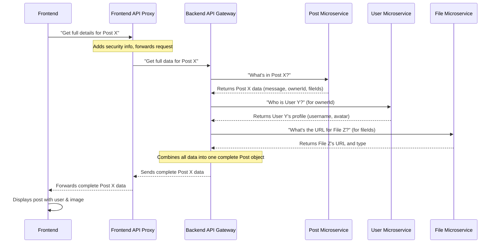

# Chapter 1: API Communication & Data Models

## Introduction: Talking Together

Welcome, aspiring game developers! If you're building a big online project like `Game Devs Connect`, you'll soon realize it's not just one big program. Instead, it's like a bustling city with many different "departments" or "buildings," each doing its own job. For example, one department might handle all the posts, another manages user accounts, and a third takes care of uploaded files.

But here's the big question: **How do these separate departments talk to each other?** How does the "Post Department" know who posted a message, or how does the "User Account Department" tell the "Frontend Website" that you've successfully logged in? They might even be running on different computers!

This is where **API Communication & Data Models** come in! They are the secret sauce that lets all these different pieces of your application chat and work together smoothly.

## The Big Problem: Speaking Different Languages

Imagine you're trying to communicate with someone who speaks a completely different language. You'd need a translator and a dictionary, right?

In `Game Devs Connect`, our Frontend (the part you see in your web browser) speaks a language like "Next.js/TypeScript." Our Backend Microservices (the hidden departments that do the heavy lifting) speak a different language, like ".NET." For them to work together without confusion, they need:

1.  A clear way to **ask for information or send commands** (this is **API Communication**).
2.  A shared understanding of **what that information looks like** (these are **Data Models** or **Interfaces**).

## Our Central Use Case: Showing a Post

Let's make this real. Imagine you open the `Game Devs Connect` homepage and see a post. It doesn't just show the message; it also displays the **username** of the person who posted it and any **images** attached.

How does our Frontend gather *all* this information, especially when it might come from different Backend departments (like the Post, User, and File services)? This chapter will show you!

## What Are APIs and Data Models?

Think of it like this:

### APIs: The Menu

An **API** (which stands for **Application Programming Interface**) is like a **menu at a restaurant**. It lists all the "dishes" (pieces of information or actions) you can "order" (request) and briefly describes what each "dish" will contain when it arrives (responses).

For `Game Devs Connect`, the API lists things like:
*   "Get me all new posts."
*   "Create a new user account."
*   "Upload a file."

### API Communication: Ordering Food

**API Communication** is the **actual act of ordering food** from the menu (sending a request) and the waiter bringing you the food (receiving a response). It's the back-and-forth conversation between different parts of the software.

### Data Models (or Interfaces): The Recipe Book

**Data Models** (sometimes called **Interfaces** or **DTOs - Data Transfer Objects**) are like the **recipe for each dish** on the menu. They define *exactly* what "ingredients" go into a "Post" (e.g., message, who owns it) or a "User" (e.g., username, avatar picture) and in what specific "shape" or order.

They act like a **shared dictionary or contract** so both sides (Frontend and Backend) agree on the exact format of the information being sent and received. This prevents misunderstandings!

## How `Game Devs Connect` Connects: The Smart Middleman

In `Game Devs Connect`, our Frontend doesn't directly talk to *every single* little Backend department. Instead, it uses a smart middleman to make things simpler:

### The Frontend's Helper: API Proxy

The Frontend has its own helper called the **API Proxy**. Think of it as a helpful assistant that stands between your web browser and the real Backend. Your browser tells this assistant what it needs, and the assistant then securely forwards the request to the right place in the Backend. This means your Frontend only ever needs to know one address: its own assistant's address!

### The Backend's Helper: API Gateway

The Backend has its own central smart receptionist called the **API Gateway**. When the Frontend's assistant sends a request, it goes to this Gateway. The Gateway knows *which* specific Backend department (e.g., the Post service, the User service) handles that kind of request. It then routes the request to the correct department, gathers all the necessary information, and sends it back.

## Solving Our Use Case: Getting All Post Details

Let's revisit our use case: you want to view a post with its message, owner's username, and attached images.

### Step 1: Frontend Asks for a Post (The Request)

Here's how the Frontend asks for this information. It's like telling its assistant, "Hey, I need Post number '123' with *all* its details!"

#### Code Example: Frontend Request

```typescript
// GameDevsConnect.Frontend/GameDevsConnect.Frontend.Web/services/post_service.ts

import axios from "axios"; // A popular tool for sending web requests
import { getUrl } from "@/lib/api"; // Our helper to build the correct web address

const url = getUrl('json', 'post'); // This builds the starting part of our Post API address

export const getPostAsync = async (id: string) => {
    // This line sends a "GET" request to our Backend.
    // Example of the final web address: YOUR_APP_URL/api/json/api/v1/post/full/123
    return await axios.get(`${url}/full/${id}`).then(response => response.data);
}
```
**What this code does:**
*   `getPostAsync` is a function in our Frontend. When we call it with a post `id` (like "123"), it's like asking the waiter for "Post #123, with all its details."
*   `axios.get` is the tool that sends this request over the internet.
*   The `url` variable is created by `getUrl`, which basically builds the first part of the full web address (`URL`) for the Post department.

#### Code Example: Building the URL

The `getUrl` helper is simple but important:

```typescript
// GameDevsConnect.Frontend/GameDevsConnect.Frontend.Web/lib/api.ts

export const getUrl = (methodType: string, endpointName: string) => {
  // This combines parts to form a full web address like:
  // YOUR_PUBLIC_URL/api/json/api/v1/post
  return `${process.env.NEXT_PUBLIC_URL}/api/${methodType}/api/v1/${endpointName}`;
};
```
**What this code does:** `getUrl` takes two pieces of info (`methodType` and `endpointName`) and sticks them together with other fixed parts to create the complete web address for the specific Backend service we want to talk to. For example, `getUrl('json', 'post')` creates a URL that points to the API Gateway's "post" service, ready to handle `json` data.

### What Happens "Under the Hood"? (The API Proxy in Action)

When the Frontend calls `getPostAsync(id)`, here's the entire journey of that request:



#### Diving into the API Proxy Code

The "Frontend API Proxy" is a special file in our Frontend application. It catches all requests going to `/api/json/...` and then forwards them to the *real* Backend. This keeps the real Backend's address hidden from your browser, which is a good security practice!

#### API Proxy Code Example

```typescript
// GameDevsConnect.Frontend/GameDevsConnect.Frontend.Web/pages/api/json/[...path].ts

import { getAxiosInstance } from "@/lib/axios_config"; // For secure communication
import type { NextApiRequest, NextApiResponse } from "next";

export default async function handler(req: NextApiRequest, res: NextApiResponse) {
    let paths = req.query.path as string[]; // Extracts the "post/full/123" part
    
    // This line rebuilds the full address for the REAL Backend API Gateway
    let backendUrl = `${process.env.BACKEND_URL}/${paths.join('/')}`;
        
    let response = undefined;

    switch(req.method) { // Checks if the request is a GET, POST, PUT, DELETE
        case "GET":
            // Forwards the GET request to the actual Backend URL
            response = await (await getAxiosInstance()).get(backendUrl).then(x => x.data);
            break;
        // ... (other cases for POST, PUT, DELETE are here but simplified for this example)
    }
    res.status(200).json(response); // Sends the Backend's response back to the browser
}
```
**What this code does:** This `handler` function acts like the Frontend's assistant. It receives the request from your browser, figures out where it needs to go in the *real* Backend, securely sends the request there, and then passes the Backend's answer straight back to your browser.

## Data Models: The Shared Dictionary (Blueprints for Information)

Throughout this entire dance, **Data Models** (often called `interfaces` in TypeScript for the Frontend and `DTOs` in C# for the Backend) are the unsung heroes. They are like **blueprints or contracts** that both the Frontend and Backend agree upon.

Imagine a "Post" has these parts: a unique ID, a message, and who wrote it. Both Frontend and Backend need to agree on that *exact* structure.

### Why do we need them?

Without Data Models, it would be like two people trying to assemble IKEA furniture without the instruction manual – chaos! They ensure:
*   **Consistency:** Everyone expects the same "shape" of data.
*   **Clarity:** Developers know exactly what information to send or expect.
*   **Error Prevention:** The program can often catch mistakes if the data doesn't match the blueprint.

Here are some examples of these "contracts" from our project:

### `IPost` (Blueprint for a Post)

This blueprint tells both sides what a "Post" looks like:

#### Frontend Interface (TypeScript)

```typescript
// GameDevsConnect.Frontend/GameDevsConnect.Frontend.Web/interfaces/post.ts

export interface IPost {
    id:string;           // Unique ID for this post (e.g., "abc-123")
    parentId:string | null; // If it's a comment, ID of the original post
    message:string;      // The text content of the post
    ownerId:string;      // ID of the user who created the post
    hasQuest:boolean;    // Does this post relate to a quest?
    created:string | null; // When was the post created?
    // ... other details like project ID, deletion status, etc.
}
```
**Explanation:** When the Frontend asks for a `Post`, it expects an object that *must* have an `id`, `parentId`, `message`, `ownerId`, `hasQuest`, `created` (among others), all of which are `string`s (text), `boolean` (true/false) or `null`. If the Backend sends something different, the Frontend will get confused!

#### Backend DTO (C#)

```csharp
// GameDevsConnect.Backend.API.Configuration.Application/DTOs/PostDTO.cs

public partial class PostDTO {
    public string Id { get; set; } = null!;
    public string ParentId { get; set; } = string.Empty;
    public bool HasQuest { get; set; }
    public string? Message { get; set; }
    public DateTime? Created { get; set; }
    public string? ProjectId { get; set; }
    public string? OwnerId { get; set; }
    public bool IsDeleted { get; set; }
    public bool Completed { get; set; }
}
```
**Explanation:** This is the Backend's version of the "Post recipe." Notice how the properties (like `Id`, `Message`, `OwnerId`) match up with the Frontend's `IPost` interface. This is the shared contract!

### `IAPIResponse` (Blueprint for all Responses)

Almost every time the Frontend talks to the Backend, it expects a general response that follows this blueprint:

#### Frontend Interface (TypeScript)

```typescript
// GameDevsConnect.Frontend/GameDevsConnect.Frontend.Web/interfaces/responses/api_response.ts

export interface IAPIResponse {
    message:string | null;      // A general message (e.g., "Success!" or "Error!")
    status:boolean;             // True if the operation was successful, false if not
    validateErrors:string[] | null; // Any specific error messages if something went wrong
}
```
**Explanation:** This way, the Frontend can always check `response.status` to know if the operation was successful, and `response.message` or `response.validateErrors` to understand what went wrong. It's a universal "Did it work?" check.

#### Backend Class (C#)

```csharp
// GameDevsConnect.Backend.API.Configuration.Contract/Responses/ApiResponse.cs

public class ApiResponse(string message, bool status, string[] validateErrors = null!) {
    public string Message { get; set; } = message;
    public bool Status { get; set; } = status;
    public string[] ValidateErrors { get; set; } = validateErrors;
};
```
**Explanation:** The Backend provides a response that perfectly matches the `IAPIResponse` blueprint. This means the Frontend always knows exactly where to look for success/failure information.

### Other Important Data Models

Just like `IPost` and `IAPIResponse`, there are many other data models that define the "shape" of other pieces of information, such as:

*   **`IFile` (Blueprint for a File):** Defines what information we expect for an attached file (like its `id`, `url` to access it, and `type`).
*   **`IUpsertPostRequest` (Blueprint for sending a New Post):** Defines the "package" of information the Frontend sends when you create a new post (e.g., the `post` data itself, and lists of `tags` or `fileIds`).

## Conclusion

In this chapter, we've explored the fundamental concepts of **API Communication & Data Models** that enable different parts of `Game Devs Connect` to speak the same language. You learned that **APIs** are like menus for interaction, **API Communication** is the actual exchange of requests and responses, and **Data Models (Interfaces)** are the crucial blueprints that define the exact structure of data, ensuring both Frontend and Backend understand each other.

We saw how the Frontend uses its internal **API Proxy** (`pages/api/json/[...path].ts`) as a smart middleman to talk to the Backend's **API Gateway**, which then orchestrates communication between all the specialized microservices. This system is like a universal translator combined with a shared dictionary, making complex interactions seamless.

Now that we understand how these pieces communicate, how do we make sure our Frontend is well-organized and ready to display all this information to the users? That's what we'll explore in the next chapter!

[Next Chapter: Frontend Web Application](02_frontend_web_application_.md)