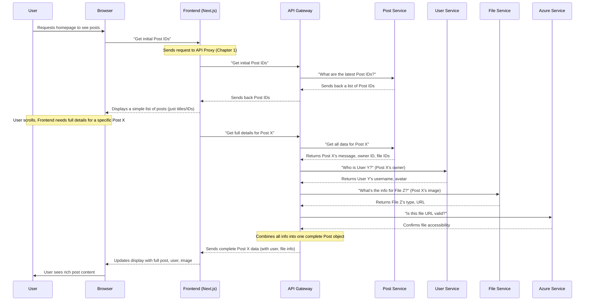

# Chapter 4: Backend Microservices

Welcome back, aspiring game developers! In [Chapter 3: Authentication System](03_authentication_system_.md), we learned how `Game Devs Connect` securely identifies you when you log in. You've also seen how the [Frontend Web Application](02_frontend_web_application_.md) displays posts and helps you interact.

You've made requests like "log me in," "show me the latest posts," or "upload this image." But where do these requests go? Where is all the information about users, posts, quests, and files actually stored and managed?

That's where the **Backend Microservices** come in!

### What Problem Do Backend Microservices Solve?

Imagine `Game Devs Connect` becomes super popular overnight, with millions of users creating posts, favoriting quests, and uploading tons of images. If all of this data and all the logic (like checking passwords, saving posts, finding quests, managing files) were handled by **one giant program**, it would become a huge mess!

*   **Fragile:** A small mistake in one part (like saving posts) could break the entire system (like user logins).
*   **Hard to Scale:** If everyone is uploading images, but the login system isn't busy, you'd still have to make the *entire giant program* bigger, even the parts that don't need it. This wastes resources.
*   **Slow Development:** Many developers working on one giant program can accidentally interfere with each other's work, slowing things down.

**Our Central Use Case:** How does `Game Devs Connect` efficiently manage a growing number of users, posts, quests, and uploaded files, ensuring that a problem in one area (like file uploads) doesn't stop the entire website from working?

### What are Backend Microservices?

Think of `Game Devs Connect` as a **large, specialized company**. Instead of one person trying to do *everything* (finance, HR, marketing, sales), the company has many **small, independent departments**.

*   Each **department** is like a **Microservice**.
*   Each microservice is **responsible for one specific function**. For example:
    *   The "User Accounts Department" (User Microservice) only handles user logins, profiles, and permissions.
    *   The "Content Department" (Post Microservice) only manages posts and comments.
    *   The "Storage Department" (File Microservice) only deals with storing and retrieving uploaded images and files.
*   These "departments" are built using **.NET**, a powerful software framework.
*   They **communicate with each other** when they need information from another department (e.g., when showing a post, the Content Department asks the User Accounts Department "who posted this?"). This communication happens using [API Communication & Data Models](01_api_communication___data_models_.md).

This **modular approach** means different parts of `Game Devs Connect` can be developed, updated, and scaled independently. If the "File Storage" department gets really busy, we can just make *that one department* bigger, without affecting the "User Accounts" department.

### How `Game Devs Connect` Uses Microservices

You've already interacted with these microservices without even knowing it!

*   When you **logged in with Discord** ([Chapter 3: Authentication System](03_authentication_system_.md)), the Frontend talked to our **User Microservice** to check or create your account.
*   When you **scrolled through posts** or **created a new one**, the Frontend talked to the **Post Microservice** to get or save that information. If you added an image, it also talked to the **File Microservice** and the **Azure Microservice** (for storing the actual picture).

### What Happens "Under the Hood"?

Let's trace how these specialized departments work together when you ask for something complex, like viewing a post that includes an image and details about its owner.



This diagram shows how the **API Gateway** acts as a central receptionist. Instead of the Frontend needing to know about *every single microservice*, it just talks to the Gateway. The Gateway then knows which specialized service to ask for which piece of information (Post, User, File, Azure), gathers all the answers, and sends them back to the Frontend.

#### Specialization: One Job Per Service

The core idea of microservices is **single responsibility**. Each service is designed to do one thing and do it well.

| Microservice Name | Primary Responsibility                             | Example Actions                      |
| :---------------- | :------------------------------------------------- | :----------------------------------- |
| `User`            | Managing user accounts, basic profiles.            | Create user, get user ID.            |
| `Post`            | Handling posts, comments, and their content.       | Add post, get post by ID.            |
| `Quest`           | Managing quests, difficulties, and user favorites. | Create quest, favorite quest.        |
| `File`            | Storing details (metadata) about uploaded files.   | Register file ID, get file info.     |
| `Azure`           | Interacting with Azure cloud storage for actual files. | Upload file to cloud, get file URL.  |
| `Gateway`         | Routing all incoming requests to the correct microservice. | "Front door" for all Frontend requests. |

As you can see, there's a microservice for almost every distinct function within `Game Devs Connect`!

You can find how each of these services is "mapped" or configured in the `ApiEndpointsV1.cs` file in the `GameDevsConnect.Backend.API.Configuration` project. This file holds all the "menu items" or "addresses" for what each microservice can do.

```csharp
// GameDevsConnect.Backend.API.Configuration/ApiEndpointsV1.cs (Simplified)

public static class ApiEndpointsV1
{
    // ... other parts ...

    public static class User
    {
        public const string Group = $"api/v{{apiVersion:apiVersion}}/{nameof(User)}";
        public const string Get = $"{{id}}"; // e.g., api/v1/User/123
        public const string Exist = $"exist/{{id}}"; // e.g., api/v1/User/exist/123
        public const string Create = $"add"; // e.g., api/v1/User/add

        // ... more endpoints for User service ...
    }

    public static class Post
    {
        public const string Group = $"api/v{{apiVersion:apiVersion}}/{nameof(Post)}";
        public const string GetFull = $"full/{{id}}"; // e.g., api/v1/Post/full/456

        // ... more endpoints for Post service ...
    }

    // ... similar classes for File, Quest, Azure, etc. ...
}
```
**What this code does:** This code defines the `URL` paths (like `api/v1/User/add`) that the Frontend or other services can use to talk to the specific `User` or `Post` microservices. It's like a list of specific roads to reach each department.

#### Independent Deployment (Dockerfiles)

One of the biggest advantages of microservices is that each one can be updated and deployed **independently**. This is made possible by using `Dockerfile`s.

Each .NET microservice has its own `Dockerfile` that tells a tool called Docker how to package it into a self-contained unit (a "container"). We'll dive much deeper into Docker in [Chapter 8: Containerization (Docker)](08_containerization__docker_.md), but here's a super simplified idea for now:

Let's look at a very simplified `Dockerfile` for the `GameDevsConnect.Backend.API.User` microservice:

```dockerfile
# GameDevsConnect.Backend.API.User/Dockerfile (Simplified)

FROM mcr.microsoft.com/dotnet/aspnet:9.0 # Start with a basic .NET environment
WORKDIR /app                             # Set the working folder inside the container
COPY GameDevsConnect.Backend.API.User.dll . # Copy the finished program here
EXPOSE 8080                              # Tell the outside world this service uses port 8080
ENTRYPOINT ["dotnet", "GameDevsConnect.Backend.API.User.dll"] # Command to start the service
```
**What this code does:** This `Dockerfile` is a detailed recipe:
1.  **`FROM ...`**: Starts with a ready-to-use .NET environment.
2.  **`WORKDIR /app`**: Creates a main folder inside our packaged application.
3.  **`COPY ... .`**: Puts the finished `User` microservice program (which has been built separately) into this folder.
4.  **`EXPOSE 8080`**: Announce that this service listens for connections on port 8080.
5.  **`ENTRYPOINT [...]`**: This is the command that starts the `User` microservice when its container is launched.

This process is repeated for *every single backend microservice*, meaning each one gets its own independent package. You can see this clearly in our project's build scripts, where each service is built individually:

```bash
# Part of: Docker/build.sh (Simplified)

echo '>>>> Building Gateway'
docker build -f ../GameDevsConnect.Backend.API.Gateway/Dockerfile -t myapp_gateway ../

echo '>>>> Building Azure'
docker build -f ../GameDevsConnect.Backend.API.Azure/Dockerfile -t myapp_azure ../

# ... similar blocks for File, Notification, Post, Profile, Project, Quest, Tag, User ...
```
**What this code does:** This script explicitly runs a `docker build` command for *each* microservice's `Dockerfile`, creating a separate package (or "image") for each. This confirms the independent nature of our microservices. Each package can then be stored and run independently.

You can also see how each microservice is launched as a separate, independent process in the `AppHost/Program.cs` file, which orchestrates the entire backend setup:

```csharp
// GameDevsConnect.Backend.AppHost/Program.cs (Simplified)

// ... setup database connection ...

var user = builder.AddProject<Projects.GameDevsConnect_Backend_API_User>("user-service")
       .WithHttpEndpoint(port: 7009, name: "user-endpoint")
       .WithEnvironment("SQL_URL", "127.0.0.1, 1400") // Connects to the database
       // ... other settings ...
       .WaitFor(sql); // Waits for the database to be ready

var tag = builder.AddProject<Projects.GameDevsConnect_Backend_API_Tag>("tag-service")
       .WithHttpEndpoint(port: 7008, name: "tag-endpoint")
       .WithEnvironment("SQL_URL", "127.0.0.1, 1400")
       // ... other settings ...
       .WaitFor(sql);

// ... similar blocks for quest, project, profile, post, notification, file, azure ...

builder.AddProject<Projects.GameDevsConnect_Backend_API_Gateway>("gateway-service")
       .WithHttpsEndpoint(port: 7000, name: "gateway-endpoint")
       // ... sets up URLs for all other microservices ...
       .WaitFor(azure) // Waits for all other services to be ready
       .WaitFor(file)
       // ... and so on ...
       .WaitFor(user);
```
**What this code does:** This central configuration file (used during local development and deployment) shows that each microservice (like `User`, `Tag`, `Quest`) is launched as its *own distinct application* with its own address (port) and settings. The `Gateway` service then knows the addresses of all these other individual services.

### Conclusion

In this chapter, we've taken a significant step behind the scenes of `Game Devs Connect`. You now understand that the project's **Backend is not one giant program, but many small, independent services, each with a specialized job.** This **microservices architecture**, built with **.NET**, allows `Game Devs Connect` to be more robust, scalable, and easier to develop. We saw how these services act like specialized departments in a company, communicating through a central **API Gateway** to fulfill complex requests from the Frontend. We also briefly explored how each service is packaged independently using `Dockerfile`s.

Now that you know these hidden departments exist and how they work together, we can dive into what specific information they manage. In the next chapter, we'll focus on the services responsible for **Post & Content Management**.

[Next Chapter: Post & Content Management System](05_post___content_management_system_.md)