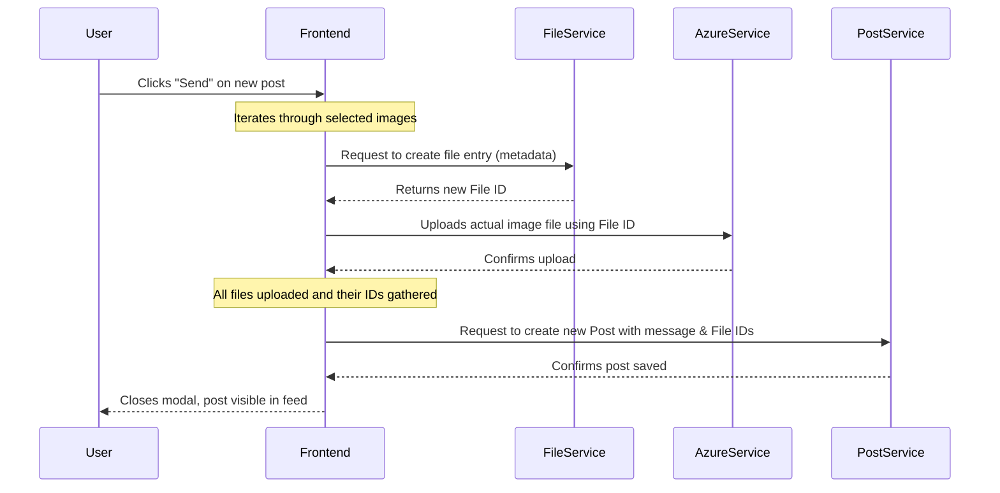

# Chapter 5: Post & Content Management System

Welcome back, aspiring game developers! In [Chapter 4: Backend Microservices](04_backend_microservices_.md), we learned about the hidden "departments" of `Game Devs Connect` that handle specific tasks, like managing users or files. You now know that when you ask to "see a post," these backend services work together behind the scenes.

But now that you can see the platform and even log in, what's one of the first things you'll want to do? **Share your amazing game development journey!** Or maybe you want to see what other developers are up to.

That's where the **Post & Content Management System** comes in!

### What Problem Does It Solve?

Imagine you just finished a cool new feature for your game, or you're stuck on a tricky bug and want to ask for help from the community. Maybe you want to show off some new concept art. You need a way to **share your thoughts, progress, and questions** with the `Game Devs Connect` community. You also need a way to **see what others are sharing**!

If `Game Devs Connect` didn't have a way to easily create and view content, it would be a very quiet place!

**Our Central Use Case:** You want to **create a new post that includes a text message and an image** to show off a new character design in your game. Then, you want to **see that post appear instantly in the main feed** alongside others.

### What is Post & Content Management?

Think of Post & Content Management as the **main bulletin board** or **social media feed** of `Game Devs Connect`. It's the central hub where:

*   Users **create** new pieces of content, which we call "posts."
*   Posts can include simple **text messages** and cool **image attachments**.
*   Users can **view** a continuous stream of posts from others, usually by scrolling down endlessly.
*   Users can **comment** on existing posts, just like replying to a message.
*   Some posts might even be related to "quests," which we'll learn more about in the [Quest System](06_quest_system_.md) chapter.

It's the very heart of interaction on `Game Devs Connect`!

### How Does It Work? (The User Experience)

When you're logged into `Game Devs Connect`, you'll typically see a feed of posts on the homepage. There will also be an easy way for you to add your own.

1.  **Viewing Posts:** As you scroll down the homepage, new posts magically appear. This is thanks to an "infinite scroll" feature. Each post shows a message, who posted it, when, and any attached images.
2.  **Creating a New Post:** You'll usually click a "New Post" button (or similar), which brings up a small pop-up window (a "modal"). In this modal, you can type your message and add images.
3.  **Adding a Comment:** If you click on an individual post, you can see its full details and find a section to type a reply. This reply then becomes a "comment" (which is just another type of post, but linked to the original).

### How the Frontend Handles Posts

Let's look at some simple code snippets that make these actions possible in the [Frontend Web Application](02_frontend_web_application_.md).

#### 1. Displaying Posts (The Infinite Scroll Feed)

In [Chapter 2: Frontend Web Application](02_frontend_web_application_.md), we briefly saw `InfiniteScrollPosts`. This is the component that shows you all the posts and loads more as you scroll.

```typescript
// GameDevsConnect.Frontend/GameDevsConnect.Frontend.Web/components/infinite_scroll_posts.tsx

import { getPostIdsAsync } from "@/services/post_service"; // To get more post IDs
import { useEffect, useState } from "react";
import { useInView } from "react-intersection-observer"; // Checks if element is visible
import ShowPosts from "./post/show_posts";

export default function InfiniteScrollPosts({initialIds, search, parentId}) {
    const [ids, setIds] = useState(initialIds); // List of post IDs
    const [page, setPage] = useState(1);       // Current "page" for loading more
    const [ref, inView] = useInView();          // 'ref' watches an element, 'inView' is true if visible

    const loadMoreIds = async () => {
        const next = page + 1;
        const response = await getPostIdsAsync(next, 5, search, parentId); // Ask backend for IDs
        
        if (response.status && response.ids.length > 0) {
            setPage(next);
            setIds(prev => [...new Set([...prev, ...response.ids])]); // Add new IDs
        }
    }

    useEffect(() => {
        if (inView) loadMoreIds(); // When the "loading" element is visible, load more
    }, [inView]);

    return (
        <div>
            <ShowPosts ids={ids} comment={parentId !== ''}/> {/* Display the posts */}
            <div ref={ref}>LOADING ...</div> {/* This div is watched by 'useInView' */}
        </div>
    );
}
```
**What this code does:**
*   It keeps a list of `ids` (unique identifiers for posts) that it needs to display.
*   `useInView()` is a clever tool: when the `LOADING ...` text at the bottom of the screen becomes visible (meaning you've scrolled close to the end), it tells the component to run `loadMoreIds()`.
*   `loadMoreIds()` then asks the Backend (using `getPostIdsAsync` from `post_service.ts`) for *more* post IDs.
*   Once new IDs arrive, they are added to the list, and `ShowPosts` updates to display the new content. This creates the "infinite scroll" effect!

The `ShowPosts` component then takes all those `ids` and tells another component, `ShowPost`, to display each one individually.

```typescript
// GameDevsConnect.Frontend/GameDevsConnect.Frontend.Web/components/post/show_posts.tsx

import { useRouter } from "next/router";
import ShowPost from "./show_post";

export default function ShowPosts({ids, comment}) {
    const router = useRouter();

    const onClickHandler = (id:string) => {
      if(!comment) router.push(`/post/${id}`); // Click opens full post page
    }

    return (
        <>
            { 
              // Loop through each post ID and display a ShowPost component
              ids.map(x => (
                <div onClick={() => onClickHandler(x)} style={{margin:'8px 0'}} key={x}>
                  <ShowPost id={x} page={false}/> {/* Display one post */}
                </div>
              ))
            }
        </>
    );
}
```
**What this code does:** This component simply loops through the `ids` it receives and creates a `ShowPost` component for each one. This ensures every post ID gets its own visual representation on the screen. If you click on a post (and it's not a comment), it takes you to a dedicated page for that post.

Now, let's see how a single post is actually displayed:

```typescript
// GameDevsConnect.Frontend/GameDevsConnect.Frontend.Web/components/post/show_post.tsx

import styles from '@/styles/post/post.module.css'
import PostContent from "./post_content"; // Component to display images/files
import { useEffect, useState } from 'react';
import { getPostAsync } from '@/services/post_service'; // To get full post data

export default function ShowPost({ id, page }) {
    const [response, setResponse] = useState(); // Stores all post data
    const [images, setImages] = useState([]); // Stores image files
    
    useEffect(() => {
        const get = async () => {
            const r = await getPostAsync(id); // Ask backend for all details
            if (!r.status) return;

            setImages(r.files.filter(x => x.type.includes('image'))); // Filter images
            setResponse(r); // Store the full response
        }
        get(); // Fetch post data when the component loads
    }, [id]);

    return (
        <div className={styles.main}>
            {response && ( // Only display if we have post data
                <article>
                    <header>
                        <p>{response?.owner.username}</p> {/* Post owner's username */}
                        <p>{new Date(response?.post.created!).toLocaleDateString()}</p>
                    </header>
                    <div>
                        <p className={styles.message}>{response?.post.message}</p>
                    </div>
                    <div>
                        {images.map(x => ( // Loop through images and display them
                            <div key={x.id}><PostContent file={x} /></div>
                        ))}
                    </div>
                </article>
            )}
        </div>
    );
}
```
**What this code does:**
*   When a `ShowPost` component loads, it immediately asks the Backend (using `getPostAsync`) for all the details of that specific post (message, owner, associated files, etc.).
*   Once it gets the data, it displays the post's message, the username of the person who posted it, and any attached images (using the `PostContent` component for the images). `PostContent` simply checks the file type and displays an `` tag if it's an image.

#### 2. Creating a New Post (The `AddPostModal`)

When you want to create a post, a modal window pops up. This `AddPostModal` handles everything from typing your message to uploading images.

```typescript
// GameDevsConnect.Frontend/GameDevsConnect.Frontend.Web/components/modal/add_post_modal.tsx

import { addFileAsync } from '@/services/file_service'; // To add file info to backend
import { addPostAsync } from '@/services/post_service'; // To add post info to backend
import { uploadFile } from '@/services/azure_service'; // To upload image to cloud storage
import { useState } from 'react';

export default function AddPostModal({setOpenModal, openModal, postId, userId}) {
    const [message, setMessage] = useState(''); // For the text message
    const [images, setImages] = useState([]);   // To store image files selected by user

    const onAddImage = (e) => {
        if (e.target.files?.[0]) {
            const file = e.target.files[0];
            if (images.length < 4 && file) setImages(prev => [...prev, file]);
        }
    }

    const sendHandler = async () => {
        const fileIds = []; // To store IDs of uploaded files

        for (const image of images) {
            // 1. Tell our backend about the file (get an ID for it)
            const responseAddImageFile = await addFileAsync({url:'',type:image.type,size:image.size,ownerId:userId});
            if (!responseAddImageFile.status) continue;
            fileIds.push(responseAddImageFile.id); // Save the file ID

            // 2. Upload the actual image file to Azure Blob Storage
            const requestJson = {FileName: `${userId}/${responseAddImageFile.id}.${image.type.replaceAll('image/','')}`, ContainerName: process.env.NEXT_PUBLIC_AZURE_STORAGE_CONTAINERNAME};
            await uploadFile(image, JSON.stringify(requestJson));
        }

        // 3. Send the post data to our backend
        const post = {parentId: postId, message, ownerId: userId, hasQuest: false};
        await addPostAsync({ post, tags: [], fileIds });

        setOpenModal(false); // Close the modal
    }

    return (
        <div style={{visibility:openModal ? 'visible':'hidden'}}>
            <div>
                <textarea value={message} onChange={(e) => setMessage(e.target.value)} placeholder='Add Message here...'/>
                <label htmlFor="imageUpload"><i className="fa-regular fa-image"></i></label>
                <input type="file" id="imageUpload" style={{display:'none'}} onChange={onAddImage}/>
            </div>
            <div>
                {images.map((x, index) => )}
            </div>
            <div onClick={sendHandler}><p>Send</p></div>
        </div>
    );
}
```
**What this code does:**
*   It lets you type a `message` and add `images` by selecting files.
*   When you click "Send" (`sendHandler`), it does a lot of work:
    1.  For each image you selected, it first tells our Backend that a new file *exists* (using `addFileAsync`), which gives us a unique ID for that file.
    2.  Then, it takes the actual image data and uploads it to a secure cloud storage service (Azure Blob Storage) using `uploadFile`. This separates the file content from our main database, making our system more efficient.
    3.  Finally, it creates the post object with your message and sends it to our Backend, along with the IDs of the images you uploaded. This way, our Backend knows which images belong to which post.

#### 3. Adding a Comment

Adding a comment is very similar to adding a new post, but it's specifically linked to an existing post (its "parent").

```typescript
// GameDevsConnect.Frontend/GameDevsConnect.Frontend.Web/components/post/add_comment.tsx

import { useState } from "react";
import { addPostAsync } from '@/services/post_service'; // To add the comment

export default function AddComment({userId, postId}) {    
    const [message, setMessage] = useState(''); // For the comment text

    const sendHandler = async () => {
        // Create a new post object, but set its parentId to the post we're commenting on
        const post = { parentId: postId, message, ownerId: userId, hasQuest: false };
        // No images or tags for comments in this simplified example
        const addPost = { post, tags: [], fileIds:[] };

        await addPostAsync(addPost); // Send the comment to the backend
        // After sending, you might refresh the page to show the new comment
    }

    return (
        <div>
            <textarea onChange={(e) => setMessage(e.target.value)} placeholder='Add Message here...'></textarea>
            <div onClick={sendHandler}><p>Send</p></div>
        </div>
    );
}
```
**What this code does:** This component is a simplified version of the post creation. The key difference is that when it creates the `post` object, it sets the `parentId` property to the `postId` of the original post. This tells our Backend that this new "post" is actually a comment on another one.

### What Happens "Under the Hood"?

Let's trace the journey of creating a post with an image, from your click to it being saved in our system.



This diagram shows how the Frontend coordinates with different "services" to get your post and its images stored correctly.

#### The Services: Talking to the Backend

Our Frontend doesn't directly touch the databases where posts and files are stored. Instead, it talks to different "services" (as discussed in [Chapter 1: API Communication & Data Models](01_api_communication___data_models_.md) and implemented as [Backend Microservices](04_backend_microservices_.md)) which then communicate with those databases.

1.  **`post_service.ts` (For Posts):**
    This service handles all operations related to our posts, like getting them, adding them, or updating them.

    ```typescript
    // GameDevsConnect.Frontend/GameDevsConnect.Frontend.Web/services/post_service.ts

    import { getUrl } from "@/lib/api" // Helper to build URL
    import axios from "axios" // Tool to make web requests

    const url = getUrl('json','post'); // Points to our Post Management Backend

    export const getPostIdsAsync = async (page=1, pageSize=10, searchTerm='', parentId='') => {   
        // Asks the backend for a list of post IDs based on filters
        return await axios.get(`${url}?page=${page}&pageSize=${pageSize}&parentId=${parentId}&searchTerm=${searchTerm}`).then(x => x.data)
    }

    export const getPostAsync = async (id:string) => {
        // Asks the backend for the full details of a specific post
        return await axios.get(`${url}/full/${id}`).then(x => x.data)
    }

    export const addPostAsync = async (addPost) => {
        // Sends new post data to the backend to create a new post (or comment)
        return await axios.post(`${url}/add`, addPost).then(x => x.data)
    }
    ```
    **Explanation:** These functions are like messengers. They send requests to our "Post Backend" to get lists of post IDs, get the full content of a specific post, or send new post (or comment) data to be saved. The `getUrl` helper builds the correct address for the `Post` microservice.

2.  **`file_service.ts` (For File Information):**
    This service is responsible for telling our Backend about the *metadata* of a file (like its type and size), not the actual file content itself.

    ```typescript
    // GameDevsConnect.Frontend/GameDevsConnect.Frontend.Web/services/file_service.ts

    import { getUrl } from "@/lib/api"
    import axios from "axios"

    const url = getUrl('json','file'); // Points to our File Management Backend

    export const addFileAsync = async (file) => {
        // Sends new file metadata to our backend to create a record for the file
        return await axios.post(`${url}/add`, file).then(x => x.data);
    }
    ```
    **Explanation:** When you add an image, the `addFileAsync` function first sends details like the image's type (`image/png`) and size to our Backend. The Backend then creates a record for this file and gives it a unique ID, which we use later to store the actual image.

3.  **`azure_service.ts` (For Uploading Actual Files):**
    This service handles the actual uploading of image (or other) files to **Azure Blob Storage**, which is a cloud service designed for storing large amounts of data. This keeps the actual image files separate from our main database for efficiency.

    ```typescript
    // GameDevsConnect.Frontend/GameDevsConnect.Frontend.Web/services/azure_service.ts

    import axios from "axios"

    // This URL goes to a special API endpoint that handles Azure uploads
    const url = 'https://localhost:3000/api/form/azure'; // Example URL

    export const uploadFile = async (file:File, request:string) => {
        // This sends the actual file content (the image data) to Azure via our API
        return await axios.postForm(url, {file, request}).then(x => x.data);
    }
    ```
    **Explanation:** The `uploadFile` function takes the actual image data you selected and sends it to a special "endpoint" (a specific address) in our API. This endpoint then securely uploads the image to Azure Blob Storage, where it will be stored efficiently. The `FileName` we create (like `userId/fileId.png`) helps us uniquely identify and retrieve the image later.

#### Data Structures for Posts and Requests

For our system to work smoothly, we need clear definitions of what a "post" is and what information is sent when we add one. These are our [Data Models](01_api_communication___data_models_.md).

*   **`IPost` (What a Post Is):**
    ```typescript
    // GameDevsConnect.Frontend/GameDevsConnect.Frontend.Web/interfaces/post.ts

    export interface IPost {
        id:string;           // Unique ID for this post
        parentId:string | null; // If it's a comment, ID of the parent post
        message:string;      // The text content of the post
        ownerId:string;      // ID of the user who created the post
        hasQuest:boolean;    // Does this post have a quest attached?
        created:string | null; // When the post was created
        // ... other details like projectId, isDeleted, completed
    }
    ```
    **Explanation:** This blueprint tells us all the pieces of information that make up a `Game Devs Connect` post. The `parentId` is especially important for comments, linking them back to the original post.

*   **`IUpsertPostRequest` (How We Send Post Data):**
    When we send a request to add a post, we don't just send the `IPost` object. We also include related information.

    ```typescript
    // GameDevsConnect.Frontend/GameDevsConnect.Frontend.Web/interfaces/requests/post/api_add_post_request.ts

    import { IPost } from "@/interfaces/post";
    // import { ITag } from "@/interfaces/tag"; // Tags are keywords for posts

    export interface IUpsertPostRequest {
        post:IPost;          // The actual post data
        tags:any[];          // Any tags associated with the post (e.g., #gamedev)
        fileIds:string[];    // A list of IDs for any attached files/images
    }
    ```
    **Explanation:** This structure defines the package of information we send to the Backend when creating or updating a post. It includes the `post` itself, any `tags` (keywords) that describe it, and importantly, the `fileIds` of any images or files attached to it.

### Conclusion

In this chapter, we've explored the **Post & Content Management System**, the dynamic heart of `Game Devs Connect`. You now understand how you can view an endless stream of posts, create your own messages with images, and add comments. We've seen how the Frontend components (like `InfiniteScrollPosts`, `ShowPost`, `AddPostModal`) work together with various services (`post_service.ts`, `file_service.ts`, `azure_service.ts`) to handle the process of fetching, displaying, and creating content.

But `Game Devs Connect` isn't just about sharing; it's also about collaboration and challenges! Next, we'll dive into how users can participate in specific tasks and objectives within the platform.

[Next Chapter: Quest System](06_quest_system_.md)
