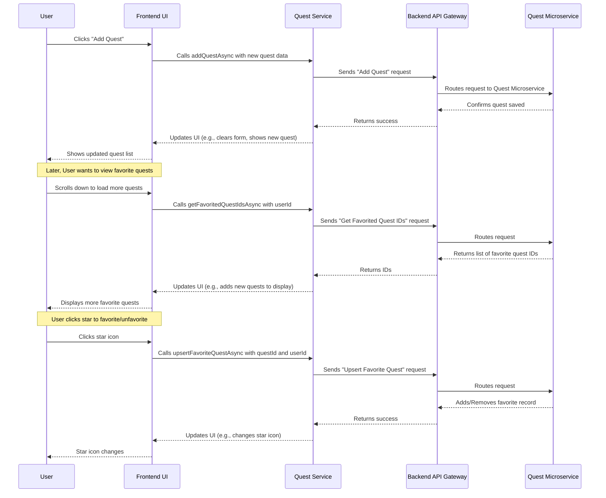

# Chapter 6: Quest System

Welcome back, aspiring game developers! In [Chapter 5: Post & Content Management System](05_post___content_management_system_.md), you learned how to share your ideas and progress with the community through posts and comments. That's great for general discussions!

But what if you need help with a very specific task in your game project? Or what if you want to challenge others with a fun coding puzzle? Just posting a message might get lost in the feed. This is where a more structured approach comes in, which is exactly what the **Quest System** provides!

### What Problem Does It Solve?

Imagine you're building a new game, and you need someone to design a few character models, or maybe you're stuck on a particular programming problem and want to offer a "bounty" for a solution. Simply writing a post might not clearly define the task, its difficulty, or allow others to easily find it or show their interest.

**Our Central Use Case:** You want to **create a new quest** on `Game Devs Connect` asking for help with game design. Then, you'd like to **browse a list of available quests** from other developers and **"favorite" one** that looks interesting, so you can easily track it.

### What is a Quest System?

Think of the Quest System as a **virtual "bounty board"** or a **"mission hub"** for game development tasks within `Game Devs Connect`. It's a special feature that allows users to:

*   **Define clear challenges or tasks** (quests).
*   Specify a `title`, a detailed `description`, and even a `difficulty` level (like easy, medium, hard).
*   **Discover tasks** posted by others.
*   **Track quests** they are interested in by "favoriting" them.

It adds a fun, gamified layer to `Game Devs Connect`, making collaboration more structured and engaging!

### How to Use the Quest System (The Frontend Experience)

When you're logged into `Game Devs Connect`, you'll find sections to interact with quests, similar to how you interact with posts.

#### 1. Creating a New Quest

You'll typically find an "Add Quest" area where you can input the details of your challenge.

```typescript
// GameDevsConnect.Frontend/GameDevsConnect.Frontend.Web/components/quest/add_quest.tsx

import { IQuest } from '@/interfaces/quest'; // Blueprint for a quest
import { addQuestAsync } from '@/services/quest_service'; // Talks to Backend
import { useState } from 'react'; // For managing input values

export default function AddQuest({ownerId, setQuests}) {
    const [title, setTitle] = useState<string>('');
    const [difficulty, setDifficulty] = useState<number>(1);
    const [description, setDescription] = useState<string>('');
    
    // This function runs when the user clicks the "ADD" button
    const onSendHandler = async () => {
        // 1. Create a Quest object with the entered details
        const newQuest:IQuest = {id:'', title, description, difficulty, postId:'', ownerId}; 
        
        // 2. Send the new quest data to our Backend via the quest_service
        const response = await addQuestAsync(newQuest);
        
        if (response.status) { // If the Backend says it was successful
            // Update the list of quests shown on the screen
            setQuests((prev:IQuest[]) => [...prev, newQuest]);
            // Clear the input fields for the next quest
            setTitle('');
            setDifficulty(1);
            setDescription('');
        }
    }

    return (
        <div>
            <input type="text" value={title} onChange={(e) => setTitle(e.target.value)} placeholder='Quest Title'/>
            <select value={difficulty} onChange={(e) => setDifficulty(parseInt(e.target.value))}>
                <option value="1">1</option> <option value="2">2</option> <option value="3">3</option>
            </select>
            <div onClick={() => onSendHandler()}>ADD</div> {/* Click this to save your quest! */}
            <textarea value={description} onChange={(e) => setDescription(e.target.value)} placeholder='Quest Description'></textarea>
        </div>
    )
}
```
**What this code does:**
*   It uses `useState` to keep track of what you type into the `title`, `difficulty`, and `description` fields.
*   When you click the "ADD" button, the `onSendHandler` function gathers all this information into a `newQuest` object (following the `IQuest` blueprint).
*   Then, it calls `addQuestAsync` (from our `quest_service`) to send this `newQuest` to our [Backend Microservices](04_backend_microservices_.md) for saving.
*   If the Backend confirms success, the new quest is added to the list you see on your screen, and the input fields are cleared.

#### 2. Viewing Quests (The Infinite Scroll Board)

Just like the post feed, quests are displayed in a continuously scrolling list, so you can easily browse many challenges.

```typescript
// GameDevsConnect.Frontend/GameDevsConnect.Frontend.Web/components/quest/infinite_scroll_quests.tsx

import { getFavoritedQuestIdsAsync } from "@/services/quest_service"; // To get quest IDs
import { useEffect, useState } from "react";
import { useInView } from "react-intersection-observer"; // Checks visibility
import ShowQuests from "./show_quests"; // Displays individual quests

export default function InfiniteScrollQuests({initialIds, userId}) {
    const [ids, setIds] = useState<string[]>(initialIds) // List of quest IDs
    const [page, setPage] = useState<number>(1);       // Current "page" for loading more
    const [ref, inView] = useInView();                  // 'ref' watches an element, 'inView' is true if it's visible

    const loadMoreIds = async () => {
        const next = page + 1;
        // Ask the backend for more FAVORITED quest IDs for the current user
        const response = await getFavoritedQuestIdsAsync(userId, next, 5, ''); // Simplified search
        
        if(response.status && response.ids.length > 0) {
            setPage(next) // Update the page number
            setIds(prev => [...new Set([...prev, ...response.ids])]) // Add new IDs
        }
    }
    
    useEffect(() => {
        // When the 'ref' element (our "LOADING..." text) comes into view, load more IDs
        if(inView) loadMoreIds();
    }, [inView]) // This effect runs whenever 'inView' changes

    return (
        <div>
            <ShowQuests ids={ids} /> {/* This component displays the actual quests */}
            <div ref={ref}>LOADING ...</div> {/* This div is watched by 'useInView' to trigger loading */}
        </div>
    )
}
```
**What this code does:**
*   It manages a list of `ids` for quests.
*   The `useInView()` hook monitors a hidden "LOADING..." `div` at the bottom of the list. When this `div` becomes visible (meaning you've scrolled down), the `loadMoreIds()` function is triggered.
*   `loadMoreIds()` then calls `getFavoritedQuestIdsAsync` in our `quest_service` to fetch more favorited quest IDs from the [Backend Microservices](04_backend_microservices_.md).
*   New IDs are added to the list, and the `ShowQuests` component updates to display them, creating a seamless "infinite scroll" experience.

Once the `ShowQuests` component has the IDs, it uses `ShowQuest` to display the full details of each one:

```typescript
// GameDevsConnect.Frontend/GameDevsConnect.Frontend.Web/components/quest/show_quest.tsx

import { getQuestAsync } from '@/services/quest_service'; // To get full quest data
import { useEffect, useState } from 'react';
import PreviewQuest from './preview_quest'; // Component to display one quest
import { useSession } from 'next-auth/react'; // To get current user ID
import { IUser } from '@/interfaces/user'; // Blueprint for a user

export default function ShowQuest({id, index}:{id:string, index:number}) {
    const [response, setResponse] = useState<any>(null!); // Stores all quest data
    const {data:session} = useSession(); // Get logged-in user's session from Chapter 3
    const user = session?.user as IUser; // Extract user data

    useEffect(() => {
        const get = async () => {
            // Ask the Backend for all details of this specific quest ID
            // We also send the user ID so the Backend knows if *this user* favorited it
            const r = await getQuestAsync(id, user.id); 
            
            if(r.status) setResponse(r); // Store the full response
        }
        get(); // Fetch quest data when the component loads or id/userId changes
    },[id, user.id]) // Re-run if the quest 'id' or user 'id' changes

    if(response)
        return (
            // Display the quest using the PreviewQuest component, showing if it's favorited
            <PreviewQuest quest={response.quest} favorited={response.favoritedQuest} preview={false} onQuestDeleteHandler={null} index={index}/>
        )
    else
        return <div>LOADING...</div>
}
```
**What this code does:**
*   When a `ShowQuest` component needs to display a quest, it calls `getQuestAsync` in our `quest_service`.
*   It sends both the `id` of the quest and the `userId` of the currently logged-in user. This `userId` is important because the Backend can then tell us if *this specific user* has already favorited this quest.
*   Once the data arrives, it passes it to the `PreviewQuest` component, which then draws the quest on your screen, including the correct filled or empty star icon.

#### 3. Favoriting a Quest

A key interactive feature is the ability to mark quests you're interested in.

```typescript
// GameDevsConnect.Frontend/GameDevsConnect.Frontend.Web/components/quest/preview_quest.tsx

import { IQuest } from '@/interfaces/quest' // Blueprint for a quest
import { IUser } from '@/interfaces/user'; // Blueprint for a user
import { upsertFavoriteQuestAsync } from '@/services/quest_service'; // For favoriting
import { useSession } from 'next-auth/react'; // To get current user ID
import { useState } from 'react'; // For managing favorite state

export default function PreviewQuest({quest, favorited}) { // Simplified props
    const [favorite, setFavorite] = useState<boolean>(favorited) // Tracks if currently favorited
    const {data:session} = useSession();
    const user = session?.user as IUser;

    const onFavoriteHandler = async (e: React.MouseEvent) => {
        e.stopPropagation(); // Prevents clicking the star from opening the quest details
        setFavorite(prev => !prev); // Optimistically update the star icon (changes instantly)
        
        // Tell our Backend to add or remove this quest from the user's favorites
        const requestData = {questId:quest.id, userId:user.id};
        await upsertFavoriteQuestAsync(requestData);
    }

    return (
        <div>
            <article>
                <div> {/* Quest details like title, description */}
                    <p>{quest?.title}</p> <p>{quest.difficulty}</p>
                    <p>{quest?.description}</p>
                </div>
                {/* Display a solid star if favorited, outline if not */}
                <div onClick={onFavoriteHandler}>
                    <i className={`fa-${favorite ? 'solid':'regular'} fa-star`}></i>
                </div>
            </article>
        </div>
    )
}
```
**What this code does:**
*   The `PreviewQuest` component shows a star icon that's either filled (`solid`) or outlined (`regular`), based on the `favorite` state.
*   When you click the star, `onFavoriteHandler()` is called.
*   It immediately changes the `favorite` state. This makes the star icon change instantly, so the app *feels* fast and responsive.
*   Then, it calls `upsertFavoriteQuestAsync` in our `quest_service` to send a request to the [Backend Microservices](04_backend_microservices_.md). This request tells the Backend to either add this quest to your favorites or remove it, ensuring the change is saved permanently.

### What Happens "Under the Hood"?

Let's trace how the Frontend interacts with the Backend when you create, view, or favorite quests. The `Quest Service` acts as the messenger.



This diagram shows how the `Quest Service` acts as the dedicated communication channel between your screen and the Backend for anything related to quests.

#### The Services: Talking to the Backend (`quest_service.ts`)

All the interactions with quests are managed by the `quest_service.ts` file. It contains functions that know how to send requests to the [Backend Microservices](04_backend_microservices_.md) where all the quest data is stored and managed.

```typescript
// GameDevsConnect.Frontend/GameDevsConnect.Frontend.Web/services/quest_service.ts

import { IQuest } from "@/interfaces/quest"; // Quest blueprint
import { IAPIUpsertFavoriteRequest } from "@/interfaces/requests/quest/api_upsert_favorite_request"; // Favorite request blueprint
import { getUrl } from "@/lib/api" // Helper to build backend URL
import axios from "axios"; // Tool to make web requests

const url = getUrl('json','quest') // This creates the base URL for our Quest API in the Backend

export const getQuestAsync = async (id:string, userId:string='') => {
    // Requests full details of a specific quest, and whether it's favorited by userId
    return await axios.get(`${url}/${id}?userId=${userId}`).then(x => x.data)
}

export const getFavoritedQuestIdsAsync = async (userId:string, page:number=1, pageSize:number=10, searchTerm:string='') => {
    // Requests a list of IDs for quests that the given userId has favorited
    return await axios.get(`${url}/favorites?page=${page}&pageSize=${pageSize}&userId=${userId}&searchTerm=${searchTerm}`).then(x => x.data)
}

export const addQuestAsync = async (quest:IQuest) => {
    // Sends new quest data to the backend to create a new quest
    return await axios.post(`${url}/add`, quest).then(x => x.data)
}

export const upsertFavoriteQuestAsync = async (upsertFavorite:IAPIUpsertFavoriteRequest) => {
    // Sends a request to toggle (add/remove) a quest from a user's favorites
    return await axios.post(`${url}/favorite`, upsertFavorite).then(x => x.data)
}
```
**Explanation:**
*   This file uses `axios` to send requests over the internet.
*   The `url` variable points to the specific address of the `Quest` [Backend Microservice](04_backend_microservices_.md) (e.g., `YOUR_APP_URL/api/json/api/v1/quest`).
*   Each function (`getQuestAsync`, `getFavoritedQuestIdsAsync`, `addQuestAsync`, `upsertFavoriteQuestAsync`) sends a specific type of request (like a "GET" to fetch data or a "POST" to send new data) to the Backend. The Backend then processes these requests and sends back a response.

#### Data Structures for Quests and Requests

To ensure our Frontend and Backend speak the same language (as learned in [Chapter 1: API Communication & Data Models](01_api_communication___data_models_.md)), we define specific "blueprints" for the data.

*   **`IQuest` (What a Quest Is):**
    This `interface` (blueprint) defines the essential pieces of information for any quest in our system, used by both Frontend and Backend.

    ```typescript
    // GameDevsConnect.Frontend/GameDevsConnect.Frontend.Web/interfaces/quest.ts

    export interface IQuest {
        id:string;          // Unique ID for this quest (e.g., "q-abc-123")
        postId:string;      // If related to a post, the ID of that post
        ownerId:string;     // ID of the user who created this quest
        difficulty:number;  // How hard is this quest (e.g., 1, 2, or 3)
        title:string;       // The name of the quest (e.g., "Design a new character")
        description:string; // Detailed explanation of the quest
    }
    ```
    **Explanation:** When you create a quest or receive quest data, it will always follow this structure, making it easy for the application to understand and display the information correctly.

*   **`IAPIUpsertFavoriteRequest` (How We Send Favorite Data):**
    When you favorite or unfavorite a quest, we send a small, specific package of data to the Backend.

    ```typescript
    // GameDevsConnect.Frontend/GameDevsConnect.Frontend.Web/interfaces/requests/quest/api_upsert_favorite_request.ts

    export interface IAPIUpsertFavoriteRequest {
        questId:string; // The ID of the quest being favorited/unfavorited
        userId:string;  // The ID of the user who is doing the favoriting
    }
    ```
    **Explanation:** This structure defines the minimum information the Backend needs to know *which quest* a *specific user* wants to mark as a favorite or remove from favorites.

#### The Backend's Quest Management (`QuestRepository.cs`)

On the Backend side, within the `Quest` [Backend Microservice](04_backend_microservices_.md), there's a component called `QuestRepository.cs` (or similar) that directly handles saving, retrieving, and updating quest data in the database. This is where the actual "work" of storing and fetching quests happens, relying on [Data Persistence (GDCDbContext)](07_data_persistence__gdcdbcontext__.md).

Let's look at simplified snippets from the Backend's `QuestRepository`:

```csharp
// GameDevsConnect.Backend.API.Quest.Application/Repository/V1/QuestRepository.cs (Simplified)

public class QuestRepository // This class handles saving/getting quests from database
{
    private readonly GDCDbContext _context; // Our database connection (Chapter 7)

    public async Task<ApiResponse> AddAsync(QuestDTO quest, CancellationToken token = default) {
        // Here, the backend ensures the quest data is valid
        quest.Id = Guid.NewGuid().ToString(); // Assign a unique ID
        await _context.Quests.AddAsync(quest, token); // Add the quest to the database
        await _context.SaveChangesAsync(token); // Save the changes
        return new ApiResponse(null!, true); // Tell the frontend it's successful
    }

    public async Task<GetResponse> GetAsync(string id, string userId, CancellationToken token = default) {
        var quest = await _context.Quests.FirstOrDefaultAsync(x => x.Id!.Equals(id), token); // Find the quest by ID
        bool favorited_by_user = await _context.FavoriteQuests.AnyAsync(x => x.QuestId.Equals(id) && x.UserId.Equals(userId) , token); // Check if user favorited it
        return new GetResponse(null!, true, quest!, favorited_by_user); // Return quest data and favorite status
    }

    public async Task<ApiResponse> UpsertFavoriteQuestAsync(FavoriteQuestResponse favoriteQuestResponse, CancellationToken token) {
        // Find if this quest is already favorited by this user
        var favoriteDb = await _context.FavoriteQuests.AsNoTracking().FirstOrDefaultAsync(x => x.QuestId.Equals(favoriteQuestResponse.QuestId) && x.UserId.Equals(favoriteQuestResponse.UserId), token);

        if(favoriteDb is not null)
            _context.FavoriteQuests.Remove(favoriteDb); // If it exists, remove it (unfavorite)
        else
            await _context.FavoriteQuests.AddAsync(new FavoriteQuestDTO { QuestId = favoriteQuestResponse.QuestId, UserId = favoriteQuestResponse.UserId }, token); // If not, add it (favorite)

        await _context.SaveChangesAsync(token); // Save the change to the database
        return new ApiResponse(null!, true); // Success!
    }
}
```
**What this code does:**
*   `_context` represents our database.
*   `AddAsync`: This method receives a `QuestDTO` (the Backend's version of our `IQuest` blueprint). It generates a unique ID, adds the quest to the database, and then saves it.
*   `GetAsync`: This method retrieves a specific quest from the database using its `id`. It also checks if the `userId` provided has favorited this quest and returns that information.
*   `UpsertFavoriteQuestAsync`: This method handles both adding and removing a quest from a user's favorites. It checks if the `questId` is already favorited by the `userId`. If it is, it removes the favorite; otherwise, it adds it. This is why it's called "upsert" (update or insert).

### Conclusion

In this chapter, we've unlocked the **Quest System**, transforming `Game Devs Connect` into a more dynamic platform for challenges and structured collaboration. You now understand how you can create new quests, browse existing ones through an infinite scroll, and easily mark your favorites. We explored how Frontend components (like `AddQuest`, `InfiniteScrollQuests`, and `PreviewQuest`) seamlessly interact with the `quest_service.ts` to manage these exciting tasks, and how the Backend's `QuestRepository` handles the actual data storage.

This entire system relies heavily on how we store and manage data. Next, we'll peel back another crucial layer and dive into **Data Persistence**, learning how `Game Devs Connect` securely saves all your quests, posts, and user information.

[Next Chapter: Data Persistence (GDCDbContext)](07_data_persistence__gdcdbcontext__.md)