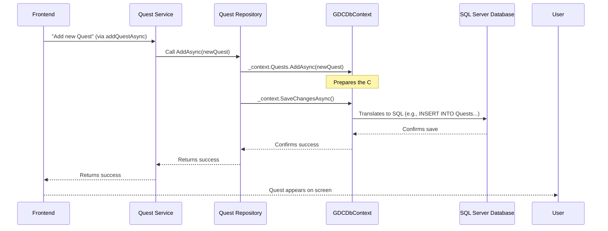

# Chapter 7: Data Persistence (GDCDbContext)

Welcome back, aspiring game developers! In [Chapter 6: Quest System](06_quest_system_.md), we learned how you can create and manage exciting quests on `Game Devs Connect`. You typed in a quest title and description, clicked "ADD," and magically, it appeared on the list!

But here's a crucial question: **What happens to all that information when you close your browser, or if the server running `Game Devs Connect` needs to restart?** Does your carefully crafted quest, or that amazing post you made, or your user profile just disappear?

If it did, `Game Devs Connect` wouldn't be very useful! This is where **Data Persistence** comes in.

### What Problem Does It Solve?

Think of your computer's memory (RAM) like your short-term memory or a whiteboard. Anything you write on it is fast, but when you turn off the computer or wipe the board, it's all gone.

For `Game Devs Connect`, we need a way to store all important information – like users, posts, and quests – permanently, even if the power goes out! This permanent storage is usually done in a **database**.

But here's the next problem: Databases speak a different language called **SQL** (Structured Query Language). Our Backend Microservices are written in **.NET** (using C# code). How do our C# programs talk to a SQL database without having to learn and write complicated SQL commands every single time?

**Our Central Use Case:** You just created a brand new quest, "Help design a new character model!" You need `Game Devs Connect` to **save this quest permanently** in its database, so it's always there for others to find, even if the application restarts tomorrow.

### What is Data Persistence (and GDCDbContext)?

**Data Persistence** simply means making sure your data **persists** (stays) over time, even when the application stops running. It's like **saving your game progress** to a hard drive so you can pick up exactly where you left off later.

In `Game Devs Connect`, this crucial job is handled by a special component called `GDCDbContext`.

Think of `GDCDbContext` as a **super-smart librarian or a translator** for your data:
*   It sits between your .NET application code and the SQL Server database.
*   Instead of you having to learn complex "library management" rules (SQL commands), you just tell the librarian (GDCDbContext) in plain English (C# code) what you want to do: "Add a new quest," "Find this user," "Update that post."
*   The `GDCDbContext` then **translates** your C# instructions into the correct SQL commands and sends them to the database.
*   When the database sends back information, `GDCDbContext` translates it back into C# objects that your application can easily understand and work with.

This magical translation and management tool is part of a larger framework called **Entity Framework Core (EF Core)**. You don't need to know all the deep technical details of EF Core right now, just that `GDCDbContext` is our project's specific way of using it.

### How GDCDbContext Saves a Quest (Solving Our Use Case)

Let's revisit our use case: saving your new quest. In [Chapter 6: Quest System](06_quest_system_.md), we saw the `QuestRepository.cs` in the Backend handling this.

The `QuestRepository` is the part of our Backend that directly talks to `GDCDbContext`. Here's a simplified look at how it saves a new quest and retrieves one:

#### Adding a New Quest

```csharp
// GameDevsConnect.Backend.API.Quest.Application/Repository/V1/QuestRepository.cs (Simplified)

public class QuestRepository 
{
    // _context is our special GDCDbContext object, the "librarian"
    private readonly GDCDbContext _context; 

    public async Task<ApiResponse> AddAsync(QuestDTO quest, CancellationToken token = default) {
        // Assign a unique ID to the quest
        quest.Id = Guid.NewGuid().ToString(); 
        
        // Tell the librarian (GDCDbContext) to add this quest to the "Quests" collection
        await _context.Quests.AddAsync(quest, token); 
        
        // Tell the librarian to *save* all pending changes to the actual database
        await _context.SaveChangesAsync(token); 
        
        return new ApiResponse(null!, true); // Report success
    }

    // ... other methods ...
}
```
**What this code does:**
*   `_context.Quests.AddAsync(quest, token);`: This line is like telling our `GDCDbContext` librarian, "Here's a new `Quest` object. Please add it to the 'Quests' section of the database." At this point, it's just prepared in the librarian's system, not fully written to the database yet.
*   `_context.SaveChangesAsync(token);`: This is the crucial step! It's like telling the librarian, "Okay, now actually **write down all those changes** (like adding the new quest) into the physical database book." This is when the data becomes permanently stored.

#### Getting a Quest

```csharp
// GameDevsConnect.Backend.API.Quest.Application/Repository/V1/QuestRepository.cs (Simplified)

public class QuestRepository
{
    private readonly GDCDbContext _context;

    // ... AddAsync method ...

    public async Task<GetResponse> GetAsync(string id, string userId, CancellationToken token = default) {
        // Tell the librarian: "Find me the first quest where its ID matches 'id'"
        var quest = await _context.Quests.FirstOrDefaultAsync(x => x.Id!.Equals(id), token); 
        
        // Tell the librarian: "Check if there's *any* favorite quest record for this user and quest"
        bool favorited_by_user = await _context.FavoriteQuests.AnyAsync(x => x.QuestId.Equals(id) && x.UserId.Equals(userId) , token); 
        
        return new GetResponse(null!, true, quest!, favorited_by_user); 
    }
}
```
**What this code does:**
*   `_context.Quests.FirstOrDefaultAsync(...)`: This line is like telling the librarian, "Go to the 'Quests' section and bring me the first quest you find that has this specific `id`."
*   `_context.FavoriteQuests.AnyAsync(...)`: This tells the librarian, "Go to the 'FavoriteQuests' section and just tell me if there's *any* record that links this `questId` to this `userId`."

Notice how you don't see any complex SQL commands like `INSERT INTO Quests (Id, Title, Description) VALUES (...)` or `SELECT * FROM Quests WHERE Id = '...'`. `GDCDbContext` handles all that translation for you!

### What Happens "Under the Hood"?

Let's trace how a "save quest" command from your Frontend (from [Chapter 6](06_quest_system_.md)) ultimately gets stored in the database.



This diagram shows that `GDCDbContext` is the critical bridge. It takes the friendly C# object (`newQuest`), converts it into the precise SQL commands the database understands, sends them over, and then confirms the operation.

### The GDCDbContext Class Itself

Now let's look at the heart of `GDCDbContext` – the actual class definition. It's located in `GameDevsConnect.Backend.API.Configuration.Application/Data/GDCDbContext.cs`.

```csharp
// GameDevsConnect.Backend.API.Configuration.Application/Data/GDCDbContext.cs (Simplified)

// This class is our special database context
public partial class GDCDbContext(DbContextOptions<GDCDbContext> options) : DbContext(options)
{
    // Each DbSet represents a "table" in our database.
    // UserDTO corresponds to the Users table.
    public virtual DbSet<UserDTO> Users { get; set; }
    // QuestDTO corresponds to the Quests table.
    public virtual DbSet<QuestDTO> Quests { get; set; }
    // PostDTO corresponds to the Posts table.
    public virtual DbSet<PostDTO> Posts { get; set; }
    // FavoriteQuestDTO corresponds to the FavoriteQuests table.
    public virtual DbSet<FavoriteQuestDTO> FavoriteQuests { get; set; }
    public virtual DbSet<FileDTO> Files { get; set; }
    // ... many more DbSets for other data types ...

    // This method tells EF Core how our C# objects map to database tables and columns
    protected override void OnModelCreating(ModelBuilder modelBuilder)
    {
        // For FavoriteQuestDTO, define its "primary key" (what makes each entry unique)
        modelBuilder.Entity<FavoriteQuestDTO>(entity =>
        {
            // A favorite is unique by combining QuestId and UserId
            entity.HasKey(e => new { e.QuestId, e.UserId }).HasName("Favorite_Quest"); 

            // Define column names in the database
            entity.Property(e => e.QuestId).HasColumnName("quest_id");
            entity.Property(e => e.UserId).HasColumnName("user_id");
        });

        // For FileDTO, define its "primary key" and column names
        modelBuilder.Entity<FileDTO>(entity =>
        {
            entity.HasKey(e => e.Id).HasName("PK__Files"); // ID is the primary key

            entity.Property(e => e.Id).HasColumnName("id");
            entity.Property(e => e.Url).HasColumnName("url");
            entity.Property(e => e.Type).HasColumnName("type");
            entity.Property(e => e.OwnerId).HasColumnName("owner_id");
            // ... more properties ...
        });

        // ... configurations for other entities like PostDTO, QuestDTO, UserDTO ...

        OnModelCreatingPartial(modelBuilder);
    }

    partial void OnModelCreatingPartial(ModelBuilder modelBuilder);
}
```
**What this code does:**
*   **`DbSet<SomeDTO>` properties:** These lines are like declaring a "list" or "collection" in your `GDCDbContext` for each type of data you want to store. For example, `DbSet<QuestDTO> Quests` means "I have a collection of `Quest` objects, and `GDCDbContext` knows how to store them in a database table called 'Quests'." `QuestDTO` is the C# blueprint (Data Transfer Object) for a Quest, which is similar to the `IQuest` interface we saw in [Chapter 6](06_quest_system_.md).
*   **`OnModelCreating` method:** This is where `GDCDbContext` gets its detailed "instructions" on how to map your C# objects (`QuestDTO`, `UserDTO`, etc.) to actual tables and columns in the SQL database.
    *   `entity.HasKey(e => new { e.QuestId, e.UserId })`: This tells `GDCDbContext` that a combination of `QuestId` and `UserId` makes each `FavoriteQuestDTO` entry unique.
    *   `entity.Property(e => e.QuestId).HasColumnName("quest_id")`: This tells `GDCDbContext` that the `QuestId` property in your C# object should be stored in a database column named `quest_id`. This ensures consistency and proper storage.

These configurations are critical for `GDCDbContext` to correctly translate between your friendly C# code and the structured world of the SQL database.

### Connecting to the Database

For `GDCDbContext` to do its job, it needs to know *where* the SQL Server database is. In `Game Devs Connect`, our SQL Server database runs inside a special isolated environment called a **Docker container**. We'll learn all about Docker in the next chapter!

For now, just know that a script like `SQL/GDC/init.sh` is used to start up our SQL Server database:

```bash
# SQL/GDC/init.sh (Simplified)

name="gamedevsconnect_server_gdc"
password="P@ssword1"
entry_port=1400
docker_network="gamedevsconnect_network"

# This command starts a SQL Server database in a Docker container
docker run -d --name $name --network $docker_network \
  -e ACCEPT_EULA=Y \
  -e SA_PASSWORD=$password \
  -p $entry_port:1433 \
  mcr.microsoft.com/mssql/server:latest

sleep 5

echo "Initiate Database Script..."
# This command runs a SQL script to create our tables (like Users, Quests, Posts)
docker run --rm --network $docker_network \
  -v $(pwd)/init.sql:/init.sql \
  mcr.microsoft.com/mssql-tools \
  /opt/mssql-tools/bin/sqlcmd -S $name -U sa -P $password -i /init.sql
```
**What this code does:**
*   The first `docker run` command starts a fresh SQL Server database.
*   The second `docker run` command connects to that newly started database and runs an `init.sql` script. This `init.sql` script contains the actual SQL commands to create all the tables (like `Users`, `Posts`, `Quests`, `FavoriteQuests`, `Files`) that `GDCDbContext` expects to work with.

This setup ensures that when our Backend Microservices start, `GDCDbContext` can find and connect to a ready-to-use SQL Server database to save and retrieve all of `Game Devs Connect`'s valuable data!

### Conclusion

In this chapter, we've uncovered the crucial role of **Data Persistence** and our project's `GDCDbContext`. You now understand that `GDCDbContext` acts as a powerful translator and manager, allowing our Backend Microservices (written in .NET) to easily store, retrieve, and manage all of `Game Devs Connect`'s data in a SQL Server database without needing to write complex SQL commands. We saw how `DbSet`s define our data collections and how `OnModelCreating` helps map our C# objects to the database structure.

This entire process relies on the database and our services running in a stable and isolated way. Next, we'll dive into the world of **Containerization (Docker)**, which is how we package and run these different parts of `Game Devs Connect` effectively.

[Next Chapter: Containerization (Docker)](08_containerization__docker__.md)