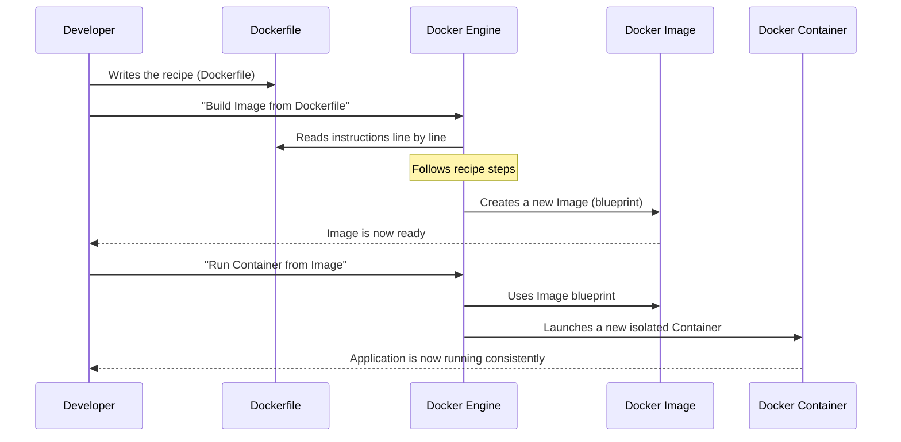

# Chapter 8: Containerization (Docker)

Welcome back, aspiring game developers! In [Chapter 7: Data Persistence (GDCDbContext)](07_data_persistence__gdcdbcontext__.md), we learned how `Game Devs Connect` securely saves all your posts, quests, and user information into a database so it never gets lost. This permanent storage is crucial for any online application.

But here's a big challenge: `Game Devs Connect` isn't just one program; it's many different pieces: the [Frontend Web Application](02_frontend_web_application_.md), several [Backend Microservices](04_backend_microservices_.md) (for users, posts, quests, files, etc.), and even a database! Each of these parts might need different software versions, specific settings, or their own programming language environments to run correctly.

### What Problem Does It Solve?

Imagine you're developing a new game, and it works perfectly on *your* computer. You send it to a friend, but when they try to run it, it crashes! They get an error saying they're missing a certain file, or their version of a graphics driver is too old. This is a super common problem in software development, often called **"It works on my machine!"**.

For `Game Devs Connect`, with its many interconnected pieces, this problem would be a nightmare! How do we make sure that:
*   The Frontend always has the right version of Node.js?
*   The Backend Microservices always have the correct .NET environment?
*   The database always starts up with the right settings?
*   And most importantly, how do we make sure *all* these parts run exactly the same way on *any* computer – whether it's a developer's laptop, a testing server, or the final live website?

**Our Central Use Case:** How do we guarantee that `Game Devs Connect` (with its Frontend, multiple Backend Microservices, and database) runs **consistently and reliably** across different environments, from a developer's computer to the public servers, preventing frustrating "it works on my machine!" issues?

### What is Containerization (Docker)?

This is where **Containerization** comes to the rescue! Think of it like a **standardized, sealed shipping crate** for your software.

*   **The Crate (Container):** Instead of just shipping your game code, you pack your code *and everything it needs to run* (like the specific operating system parts, programming languages, libraries, and settings) into one neat, isolated package. This package is called a **container**.
*   **The Blueprint (Image):** Before you can build a physical crate, you need a blueprint or a design for it. In Docker, this design is called an **image**. An image is a read-only template that tells Docker exactly what to put inside your container.
*   **The Recipe (Dockerfile):** And how do you create that blueprint (image)? You write a simple text file called a **Dockerfile**. This file is like a cooking recipe with step-by-step instructions on how to build your software's isolated environment.

**Docker** is the most popular tool that helps us create, manage, and run these containers.

**Benefits of Containerization:**

| Benefit        | Explanation                                                                                                | Analogy                                           |
| :------------- | :--------------------------------------------------------------------------------------------------------- | :------------------------------------------------ |
| **Portability** | Once packaged in a container, your application runs the same way everywhere (laptop, cloud, server).       | A pre-built, self-contained LEGO kit.             |
| **Consistency** | Eliminates "it works on my machine!" problems because the environment is always the same inside the container. | Every shipping crate is identical inside.         |
| **Isolation**   | Each part of your application (e.g., Frontend, User Service) runs in its own separate container "box," so they don't interfere with each other. | Separate, sealed compartments in a larger cargo ship. |
| **Efficiency**  | Containers are lightweight and start quickly compared to full virtual machines.                            | Smaller, easier-to-move packages.                 |

### How `Game Devs Connect` Uses Docker (Solving Our Use Case)

In `Game Devs Connect`, **every single major component** – the [Frontend Web Application](02_frontend_web_application_.md), each [Backend Microservice](04_backend_microservices_.md) (like User, Post, Quest, File, Azure, etc.), and even the SQL Server database itself – is packaged into its own Docker container.

This means:
*   The Frontend container only cares about Node.js and Next.js.
*   The User Microservice container only cares about .NET.
*   The SQL Server container provides a ready-to-use database.
*   They all run in their own isolated "boxes," but they can still talk to each other using their network (just like we learned in [API Communication & Data Models](01_api_communication___data_models_.md)).

This ensures that `Game Devs Connect` will always work the same way for every developer and on every server!

Let's look at a simplified `Dockerfile` for our Frontend, which acts as the recipe for its container:

```dockerfile
# GameDevsConnect.Frontend/GameDevsConnect.Frontend.Web/Dockerfile

# Step 1: Start with a base environment
FROM node:23-alpine AS base 

# Set the working directory inside the container
WORKDIR /app

# Copy only the files needed for installing dependencies
COPY package.json . 
COPY package-lock.json .

# Install all project dependencies (npm ci)
RUN npm ci

# Copy all the rest of the source code
COPY . .    

# Build the Next.js application for deployment
RUN npm run build 

# Step 2: Create a smaller, final image for running
FROM node:23-alpine AS final

# Set the working directory again
WORKDIR /app

# Copy only the absolutely necessary built files and dependencies from 'base' stage
COPY --from=base /app/.next .next
COPY --from=base /app/package.json .
COPY --from=base /app/package-lock.json .
COPY --from=base /app/public ./public
COPY --from=base /app/node_modules ./node_modules

# This is the command to start the application when the container runs
CMD ["npm", "start"]
```
**What this code does:** This `Dockerfile` has two main parts, called "stages":
1.  **`FROM node:23-alpine AS base`**: This tells Docker to start with a specific pre-made environment that has Node.js (version 23, in a small "alpine" Linux version). We name this temporary step `base`.
2.  **`WORKDIR /app`**: All commands that follow will run inside a folder called `/app` within our container.
3.  **`COPY package.json .` and `RUN npm ci`**: These lines copy our project's dependency list and then install all the necessary smaller software pieces the Frontend needs.
4.  **`COPY . .`**: This copies all our Frontend's source code into the container.
5.  **`RUN npm run build`**: This command tells Node.js to "build" our Next.js website, preparing it to be served.
6.  **`FROM node:23-alpine AS final`**: This starts a *brand new, clean* environment for our final container. Why? To keep the final container as small as possible by only copying the *necessary* files from the `base` stage, not all the temporary build files.
7.  **`COPY --from=base ...`**: These lines selectively copy *only* the essential files (like the built website and installed dependencies) from our `base` stage to this `final` stage.
8.  **`CMD ["npm", "start"]`**: This is the instruction that Docker will run automatically when you launch a container from this image. It simply starts our Next.js Frontend application.

Every Backend Microservice has a similar, specialized `Dockerfile` to create its own container. You can find these in our project structure, for example: `GameDevsConnect.Backend.API.Azure/Dockerfile` or `GameDevsConnect.Backend.API.User/Dockerfile`.

### What Happens "Under the Hood"?

Let's trace how a `Dockerfile` becomes a running container:



This diagram shows that the `Dockerfile` is the starting point. The `Docker Engine` (the main Docker program on your computer) reads this recipe, bakes it into a `Docker Image` (the blueprint), and then uses that `Image` to launch a `Docker Container` (the running "crate").

### Running Multiple Containers Together: Docker Compose

`Game Devs Connect` isn't just one container; it's many! We have a Frontend, a Gateway, multiple microservices (User, Post, Quest, File, etc.), and a SQL Server database. Manually starting and connecting all these containers would be a lot of work.

This is where **Docker Compose** comes in! Think of Docker Compose as the **orchestra conductor** for your containers. Instead of giving separate instructions to each musician, the conductor (Docker Compose) has one master score (`docker-compose.yml`) that tells everyone what to play and how to play together.

A `docker-compose.yml` file defines how all the different services (containers) in your application should work together, including how they find each other on the network.

Here's a very simplified look at how `docker-compose.yml` would define some of our services:

```yaml
# Simplified docker-compose.yml
version: '3.8' # The version of the compose file format

services:
  frontend: # Our Frontend Web Application
    image: benexdrake012/gamedevsconnect_frontend:latest # Use the image we built
    ports:
      - "3000:3000" # Map local port 3000 to container's port 3000
    environment:
      - NEXT_PUBLIC_URL=http://localhost:3000 # Environment variables for the app
      - BACKEND_URL=http://gateway:7000 # How frontend finds the gateway
    depends_on:
      - gateway # Frontend needs the gateway to be running

  gateway: # Our API Gateway microservice
    image: benexdrake012/gamedevsconnect_backend_api_gateway:latest
    ports:
      - "7000:7000" # Map local port 7000 to container's port 7000
    environment:
      - SQL_URL=sql-server:1433 # How gateway finds the database
    depends_on:
      - sql-server # Gateway needs the database to be running

  sql-server: # Our SQL Server database
    image: mcr.microsoft.com/mssql/server:latest
    ports:
      - "1400:1433" # Map local port 1400 to container's port 1433
    environment:
      - SA_PASSWORD=YourStrongPassword! # Set the database password
      - ACCEPT_EULA=Y # Accept license agreement
```
**What this code does:**
*   It defines three `services`: `frontend`, `gateway`, and `sql-server`.
*   For each service, it specifies which `image` to use (the `benexdrake012/...` images are our custom-built ones).
*   `ports` maps a port on your computer (e.g., `3000`) to a port inside the container, so you can access the running application.
*   `environment` sets up important variables inside the container, like how the `frontend` finds the `gateway` (by its service name `http://gateway:7000`) or how the `gateway` finds the `sql-server` database (`sql-server:1433`). Docker Compose sets up an internal network so these services can talk to each other by their names.
*   `depends_on` ensures that services start in the correct order (e.g., `frontend` waits for `gateway` to be ready).

To run this entire setup, you would simply navigate to the folder with `docker-compose.yml` and type:
```bash
docker compose up
```
And Docker Compose would automatically build (if needed), start, and connect all your containers! This `docker-compose.yml` file is crucial for local development and testing of `Game Devs Connect` as it brings up the entire application stack with a single command. You can find the full `docker-compose.yml` in the project's root directory.

### Conclusion

In this chapter, we've explored the fundamental concept of **Containerization** using **Docker**. You now understand that Docker provides a powerful way to package our application code with all its dependencies into isolated, portable "containers." This solves the frustrating "it works on my machine!" problem and ensures `Game Devs Connect` runs consistently everywhere. We also learned how **Docker Compose** helps us manage and run many interconnected containers together, making complex applications easier to set up and control.

Our application components are now neatly packaged in their standardized "shipping crates." But how do we get these crates from our development environment or Docker Hub to the actual cloud servers where they can be accessed by millions of players? That's the exciting world of **Infrastructure Provisioning**, which we'll explore in the next chapter!

[Next Chapter: Infrastructure Provisioning (Terraform)](09_infrastructure_provisioning__terraform__.md)