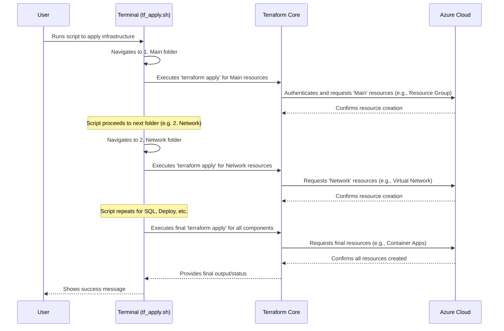

# Chapter 9: Infrastructure Provisioning (Terraform)

Welcome back, aspiring game developers! In [Chapter 8: Containerization (Docker)](08_containerization__docker__.md), we learned how to package all the different parts of `Game Devs Connect` (like our Frontend and Backend Microservices) into neat, self-contained "shipping crates" called Docker containers. These containers ensure our application runs consistently everywhere.

Now, we have all our application parts ready, packaged, and waiting. But how do we actually get these "shipping crates" from our developer's computer or a central storage (like Docker Hub) and deploy them onto **real servers, connected to real networks and databases, in the vast cloud**, so everyone can access `Game Devs Connect`?

That's where **Infrastructure Provisioning (Terraform)** comes in!

### What Problem Does It Solve?

Imagine you're trying to build a huge, complex building, like a skyscraper or a factory. You need to set up the foundation, electricity, water pipes, internet cables, and then finally place all the equipment inside. You *could* hire a team to manually put every single wire and pipe in place, one by one. This would be:

*   **Slow:** Takes ages to do manually.
*   **Error-Prone:** Easy to make mistakes (e.g., connect the wrong pipe).
*   **Inconsistent:** Different people might build things slightly differently each time.
*   **Hard to Repeat:** If you needed to build a second identical factory, you'd have to start all over again from scratch.

Setting up the "foundation" for our `Game Devs Connect` application in the cloud (like creating virtual networks, SQL databases, and the servers where our application APIs run on Azure) faces the exact same problems. Manually clicking buttons in a cloud provider's web portal to create everything is inefficient and risky.

**Our Central Use Case:** How can `Game Devs Connect` automatically create and manage its entire cloud environment – including virtual networks, SQL databases, and the places where our Backend APIs and Frontend run – from a detailed blueprint, ensuring it's always built exactly the same way, every time?

### What is Infrastructure Provisioning (Terraform)?

Think of Infrastructure Provisioning as having a **robot builder** who constructs your entire server infrastructure from a detailed **blueprint**.

*   **Infrastructure as Code (IaC):** This is the core idea. Instead of manually clicking buttons in a cloud portal, we **describe our desired infrastructure using code scripts** (the "blueprint"). These scripts tell the cloud provider exactly what resources we need (e.g., "I need a database here," "I need a virtual network there," "I need a place to run my containers").
*   **Terraform:** This is the specific "robot builder" tool that `Game Devs Connect` uses for Infrastructure as Code.
    *   You write simple configuration files (the "blueprints") that describe your infrastructure using a language called HCL (HashiCorp Configuration Language).
    *   Terraform then reads these blueprints and communicates with your chosen cloud provider (like Microsoft Azure) to automatically create, update, or even destroy those resources.

**Benefits of Terraform:**

| Benefit           | Analogy                                        | How it Helps `Game Devs Connect`                                           |
| :---------------- | :--------------------------------------------- | :------------------------------------------------------------------------- |
| **Consistency**   | The robot builder always follows the blueprint. | Ensures our cloud setup is identical across different environments.       |
| **Repeatability** | Build the same building many times perfectly.    | We can easily set up a new copy of `Game Devs Connect`'s infrastructure if needed. |
| **Speed**         | Robot works much faster than humans.           | Automates complex setups in minutes, not hours or days.                    |
| **Version Control** | Store blueprints in GitHub.                    | We can track changes to our infrastructure, just like application code.    |

### How `Game Devs Connect` Uses Terraform

`Game Devs Connect` uses Terraform to define and manage almost all of its Azure cloud resources. Instead of manually clicking through Azure's web portal, we have `.tf` files that describe everything.

Our Terraform setup is organized into several folders, each responsible for a part of the infrastructure. This is similar to how our [Backend Microservices](04_backend_microservices_.md) are separated, but here it's for infrastructure components.

Here's a simplified look at how we tell Terraform what to build:

#### 1. Configuration Variables (`.tfvars`)

We can customize our deployment using variables. For example, to set up resources for our `dev` (development) environment, we have a file like this:

```terraform
--- File: .terraform/.Config/env/dev/config.tfvars ---
application_name    = "gamedevsconnect"
environment_name    = "dev"

base_address_space = "10.0.0.0/16"
private_key_path = "../../.ssh/vm"
administrator_login = "benexdrake"
```
**What this code does:** This file acts like a "settings" file for our development environment. It defines:
*   `application_name`: The main name of our project.
*   `environment_name`: This tells Terraform we are setting up the `dev` environment.
*   `base_address_space`: A setting for our virtual network.
*   `private_key_path` and `administrator_login`: Details for creating secure virtual machines.

Terraform will use these values when building the infrastructure for `Game Devs Connect` in the `dev` environment.

#### 2. The Terraform Helper Script (`tf.sh`)

To make it easier to run Terraform commands, we use a simple shell script. Each of our modular Terraform folders (like `1. Main`, `2. Network`, etc.) has its own `tf.sh` script.

```bash
--- File: .terraform/1. Main/tf.sh ---
terraform init

# Pass any extra commands ($*) and our config files to terraform
terraform $* -var-file "../.Config/env/dev/backend_config.tfvars" -var-file "../.Config/env/dev/config.tfvars"
```
**What this code does:** This script is a wrapper for Terraform commands:
*   `terraform init`: This command prepares Terraform to work with a new or existing configuration. It downloads necessary "plugins" (called "providers") that allow Terraform to talk to Azure.
*   `terraform $*`: This is where the actual Terraform command (like `apply`, `plan`, `destroy`) is passed. The `$*` means "take whatever commands I type after `./tf.sh` and pass them directly to `terraform`."
*   `-var-file ...`: These options tell Terraform to load the settings from our `config.tfvars` file, so it knows the application name, environment, etc.

#### 3. Orchestrating the Deployment (`tf_apply.sh`)

To build the *entire* `Game Devs Connect` infrastructure, we run a main script called `tf_apply.sh`. This script goes through each logical step of our infrastructure setup, applying one part at a time.

```bash
--- File: .terraform/tf_apply.sh ---
cd ./1.\ Main/
echo ">>>>> Creating Main Resources..."
./tf.sh apply -auto-approve # Apply basic resources

cd ../2.\ Network/
echo ">>>>> Creating Network..."
./tf.sh apply -auto-approve # Apply network setup

cd ../3.\ SQL_Server/
echo ">>>>> Creating SQL Server..."
./tf.sh apply -auto-approve # Apply database server

cd ../4.\ Deploy/APIs
echo ">>>>> Creating Container and Deploy..."
./tf.sh apply -auto-approve # Apply resources to run our APIs

cd ../Admin_Dashboard
echo ">>>>> Creating Dashboard and Deploy..."
./tf.sh apply -auto-approve # Apply resources for admin dashboard

cd ../../5.\ Output/
echo ">>>>> Creating Output..."
./tf.sh apply -auto-approve # Output important information
```
**What this code does:** This is our automated "start-up" sequence for the entire `Game Devs Connect` infrastructure:
1.  `cd ./1. Main/`: It first changes into the "Main" folder, which contains Terraform files for core resources like resource groups (a logical container for all Azure resources).
2.  `./tf.sh apply -auto-approve`: It then runs our helper script, telling Terraform to `apply` the configuration in that folder. `-auto-approve` means "don't ask me for confirmation, just do it."
3.  The script then repeats this process for `2. Network` (setting up virtual networks), `3. SQL_Server` (setting up the database), `4. Deploy/APIs` (setting up the Azure Container Apps or App Services where our Docker containers will run), and so on.
Each step builds upon the previous one. For example, you can't deploy APIs until you have the network and SQL server ready.

#### 4. Tearing Down the Infrastructure (`tf_destroy.sh`)

Just as easily as we build it, we can destroy it (useful for cleaning up development environments!). This is done by running `tf_destroy.sh`, which runs the `terraform destroy` command in reverse order.

```bash
--- File: .terraform/tf_destroy.sh ---
# We destroy the "outermost" or dependent resources first
cd ./4.\ Deploy/APIs
echo ">>>>> Destroy APIs..."
./tf.sh destroy -auto-approve

cd ../../3.\ SQL_Server/
echo ">>>>> Destroy SQL Server..."
./tf.sh destroy -auto-approve

cd ../2.\ Network/
echo ">>>>> Destroy Network..."
./tf.sh destroy -auto-approve

cd ../1.\ Main/
echo ">>>>> Destroy Main Resources..."
./tf.sh destroy -auto-approve
```
**What this code does:** This script reverses the `tf_apply.sh` process. It destroys the `APIs` first (which depend on SQL and Network), then the `SQL_Server`, then the `Network`, and finally the `Main` resources. This ensures dependencies are handled correctly and resources are removed cleanly from Azure.

### What Happens "Under the Hood"?

When you run `tf_apply.sh`, here's the simplified journey of how your cloud infrastructure comes to life:


**Explanation:**
1.  **Your Command:** When you run `tf_apply.sh`, the script starts executing the commands inside it.
2.  **Modular Execution:** For each `cd` (change directory) command, the script moves into a different Terraform module folder.
3.  **Terraform Activation:** Inside each folder, `./tf.sh apply` makes Terraform activate. Terraform then reads its `.tf` files in that specific folder (e.g., `1. Main`'s files).
4.  **Talking to Azure:** Terraform translates the descriptions in the `.tf` files into commands that Azure understands. It then uses Azure's API (Application Programming Interface, as discussed in [Chapter 1: API Communication & Data Models](01_api_communication___data_models_.md)) to tell Azure exactly what to create (virtual networks, databases, servers).
5.  **Azure's Response:** Azure creates the requested resources and tells Terraform that it's done.
6.  **State Management:** As Terraform creates resources, it also keeps track of what it has built in a special file called a "state file" (usually stored securely in Azure Storage). This file acts like Terraform's memory, helping it know exactly what resources are currently managed by its blueprints.
7.  **Sequential Build:** The `tf_apply.sh` script continues this process, building each layer of infrastructure until the entire `Game Devs Connect` cloud environment is online and ready to host our containerized applications.

This automated process ensures that our complex cloud infrastructure is always set up correctly, consistently, and can be easily managed by code.

### Conclusion

In this chapter, we've explored the fundamental concept of **Infrastructure Provisioning with Terraform**. You now understand that instead of manually configuring servers and databases in the cloud, `Game Devs Connect` uses **Infrastructure as Code** blueprints and the **Terraform** tool to automate the creation, management, and even destruction of its entire Azure cloud environment. This ensures consistency, repeatability, and speed in deploying the foundational pieces for our application.

From the [Frontend Web Application](02_frontend_web_application_.md) you see, through the [Backend Microservices](04_backend_microservices_.md) and their communication, to the [Containerization (Docker)](08_containerization__docker__.md) that packages them, and now the infrastructure that hosts it all, you've gained a comprehensive understanding of how `Game Devs Connect` is built. This modular and automated approach allows us to develop, deploy, and scale `Game Devs Connect` efficiently and reliably for game developers worldwide.

But how do we automatically build our code, package it into containers, and deploy it to the infrastructure we just provisioned, all without manual intervention? That's the exciting world of **CI/CD**, which we'll explore in the next chapter!

[Next Chapter: CI/CD (GitHub Actions)](10_ci_cd__github_actions_.md)