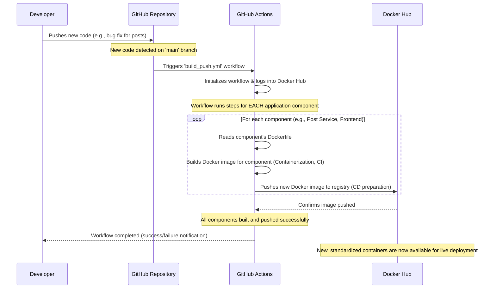

# Chapter 10: CI/CD (GitHub Actions)

Welcome back, aspiring game developers! In [Chapter 9: Infrastructure Provisioning (Terraform)](09_infrastructure_provisioning__terraform__.md), we learned how to automatically set up all the necessary cloud "real estate" – like servers, networks, and databases – for `Game Devs Connect`. We have our foundation ready!

But now, a crucial question arises: How do we get our freshly written code, our bug fixes, and our new features from a developer's computer, through all the building and testing steps, and then safely onto that cloud infrastructure, all without complicated manual steps? We need to keep our game, `Game Devs Connect`, up-to-date and running smoothly for everyone.

This is where **CI/CD (Continuous Integration/Continuous Deployment)** comes in, and **GitHub Actions** is the tool that makes it happen!

### What Problem Does It Solve?

Imagine you and your team are rapidly adding new features and fixing bugs in `Game Devs Connect`. Every time someone finishes a piece of code, there are several steps:
1.  **Building:** Compiling the code into a runnable program.
2.  **Packaging:** Turning that program into a portable [Docker container](08_containerization__docker__.md).
3.  **Testing:** Making sure the new code hasn't broken anything existing.
4.  **Deploying:** Getting the new, tested container onto the live servers.

Doing all these steps **manually** every time a small change is made would be:
*   **Slow:** Takes a lot of human effort and time.
*   **Error-Prone:** Easy to forget a step or deploy the wrong version.
*   **Inconsistent:** Different people might do it slightly differently, leading to "it works on my machine!" problems.

**Our Central Use Case:** A developer just fixed a critical bug in the Post Microservice that was preventing some users from seeing their images. How does `Game Devs Connect` ensure this fix is **automatically built into a new container**, **verified that it works**, and then **quickly delivered** to the live website for everyone, with minimal risk and no manual intervention?

### What is CI/CD (and GitHub Actions)?

Think of CI/CD as an **automated "factory line"** for your software. Instead of people manually doing everything, a smart robot system handles the entire process from start to finish.

#### CI (Continuous Integration): The Quality Control Station

*   **Goal:** To automatically build and test your code every time a developer makes a change.
*   **Analogy:** Imagine a self-checking machine on a factory line. As soon as a new part (new code) enters, this machine immediately inspects it, runs tests, and ensures it perfectly fits with all the other parts already built. If there's a problem, it flags it *immediately*, before it causes bigger issues.
*   **Benefit for `Game Devs Connect`:** Catches bugs early, ensures new code works well with existing code, and reduces "integration headaches."

#### CD (Continuous Deployment/Delivery): The Automated Shipping Department

*   **Goal:** To automatically prepare and deliver these validated (and tested) code changes to the live system (or ready for quick release).
*   **Analogy:** Once the quality control station approves a part, it's automatically packaged and sent directly to the final assembly line, or even directly into the customer's hands. No one needs to manually carry it or fill out shipping forms.
*   **Benefit for `Game Devs Connect`:** Faster updates, fewer manual deployment errors, and consistent, reliable releases to our users.

#### GitHub Actions: The Orchestrator

**GitHub Actions** is the specific tool that `Game Devs Connect` uses to build this automated factory line. It allows us to define and run these CI/CD tasks directly within our GitHub project. When you push new code to GitHub, GitHub Actions can automatically kick off our "factory line" and handle all the building, packaging, and preparing for deployment.

### How `Game Devs Connect` Uses CI/CD (Solving the Use Case)

Let's follow our central use case: a developer finishes the bug fix for the Post Microservice images.

Here's the automated journey of that new code fix:

1.  **Developer Writes Code:** A developer makes the necessary changes to the `Post` Microservice code on their computer.
2.  **Code Push to GitHub:** When the bug fix is ready, the developer pushes (uploads) the new code to the `main` branch of our `Game Devs Connect` project on GitHub.
3.  **GitHub Actions Kicks Off (CI Phase):** GitHub detects the new code on the `main` branch. This automatically triggers our CI/CD pipeline, defined in a special file named `build_push.yml`.
4.  **Automated Building & Packaging:**
    *   GitHub Actions reads the `build_push.yml` recipe.
    *   For *every single part* of `Game Devs Connect` (the [Frontend Web Application](02_frontend_web_application_.md), the Post Microservice, the User Microservice, etc.), it finds its specific [Dockerfile](08_containerization__docker__.md).
    *   It then uses **Docker** to build a fresh, standardized container image for each part, ensuring they are correctly packaged with all their dependencies. This is our "Quality Control Station."
5.  **Container Pushing to Docker Hub (CD Phase - preparing for delivery):** Once built, these new container images (e.g., `gamedevsconnect/gamedevsconnect_backend_api_post:latest`) are automatically "pushed" (uploaded) to **Docker Hub**. Docker Hub acts like a central online warehouse or registry for our standardized [Docker containers](08_containerization__docker__.md).
6.  **Ready for Deployment (CD Phase - delivery):** The new container images, including the bug fix, are now safely stored in Docker Hub. Our [Infrastructure Provisioning (Terraform)](09_infrastructure_provisioning__terraform_.md) setup can then be told to update the running applications on the live servers using these new images, completing the delivery.

#### The Automation in Action: `build_push.yml`

Our automated factory line is primarily set up in the `.github/workflows/build_push.yml` file. This file tells GitHub Actions exactly what to do.

```yaml
# .github/workflows/build_push.yml (Simplified)

name: Build_and_Push # Name of our automated workflow

on:
  push: # This workflow runs automatically when code is PUSHED
    branches: [main] # Specifically when code is pushed to the 'main' branch
    paths-ignore:
      - .github/** # Ignore changes to workflow files themselves
```
**What this code does:** This first part of the file is like the "trigger" for our factory line. It says, "Whenever new code is pushed to the `main` branch of our GitHub repository, start this `Build_and_Push` workflow." We also tell it to ignore changes to the workflow files themselves, preventing infinite loops.

Next, we define the `jobs` that will run. Our workflow has one main job called `build-stage`.

```yaml
# .github/workflows/build_push.yml (Simplified, part 2)

jobs:
  build-stage: # We have one job called 'build-stage'
    runs-on: ubuntu-latest # It runs on a fresh Ubuntu server provided by GitHub

    strategy:
      matrix: # This tells GitHub Actions to run the following steps multiple times
        include: # Once for EACH of our components!
          - path: Backend.API.Azure # One Backend Microservice
            tag: backend_api_azure
            context: ./
          - path: Frontend/GameDevsConnect.Frontend.Web # Our Frontend Application
            tag: frontend
            context: ./GameDevsConnect.Frontend/GameDevsConnect.Frontend.Web
          # ... (many more backend services would be listed here) ...
```
**What this code does:**
*   `build-stage`: This is the main task. It says, "Run this job on a fresh, temporary `ubuntu-latest` server that GitHub provides."
*   `strategy.matrix`: This is very powerful! It tells GitHub Actions, "I have a list of items (`include`), and I want you to run the *same set of steps* for *each* item in this list." In our case, each item represents one of our application components (Frontend or a Backend Microservice). This means the same build-and-push process will be automatically repeated for every part of `Game Devs Connect` that needs its own [Docker container](08_containerization__docker__.md)!

Finally, here are the actual `steps` that are run for each component:

```yaml
# .github/workflows/build_push.yml (Simplified, part 3)

    steps:
      - name: Checkout Code # Step 1: Get the latest code from GitHub
        uses: actions/checkout@v4
      
      - name: Log in to Docker Hub # Step 2: Log into our Docker image warehouse
        uses: docker/login-action@v3
        with:
          username: ${{secrets.DOCKER_USERNAME}} # Hidden secure username
          password: ${{secrets.DOCKER_PASSWORD}} # Hidden secure password

      - name: Build and Push # Step 3: This is the core step!
        uses: docker/build-push-action@v5
        with:
          context: ${{matrix.context}} # Where to find the Dockerfile for this component
          file: ./GameDevsConnect.${{matrix.path}}/Dockerfile # The specific Dockerfile path
          push: true # Yes, push the built image to Docker Hub
          tags: ${{secrets.DOCKER_USERNAME}}/gamedevsconnect_${{matrix.tag}}:latest # The name for the image
```
**What this code does:**
1.  **`Checkout Code`**: This step simply downloads the latest version of our entire `Game Devs Connect` project code onto the temporary GitHub server.
2.  **`Log in to Docker Hub`**: Before we can upload (push) our new [Docker containers](08_containerization__docker__.md) to Docker Hub, we need to log in securely. This step uses a special GitHub Action (`docker/login-action`) to do that with our hidden username and password (`secrets.DOCKER_USERNAME`, `secrets.DOCKER_PASSWORD`).
3.  **`Build and Push`**: This is the most important step! It uses another special GitHub Action (`docker/build-push-action`) that:
    *   Finds the correct [Dockerfile](08_containerization__docker__.md) for the current component (e.g., `GameDevsConnect.Frontend/GameDevsConnect.Frontend.Web/Dockerfile`).
    *   Builds the [Docker container](08_containerization__docker__.md) image based on that `Dockerfile`.
    *   And finally, uploads (`push: true`) this newly built container image to Docker Hub, giving it a clear name (like `YOUR_DOCKER_USERNAME/gamedevsconnect_frontend:latest`).

#### Manual Equivalents (Automated by CI/CD)

To understand the value of `build_push.yml`, it's helpful to see what you'd have to do manually without it.

The `Docker/build.sh` script is what you would run on your computer to build all images locally:

```bash
# Part of: Docker/build.sh (Manual build example)

echo '>>>> Building Gateway'
docker build -f ../GameDevsConnect.Backend.API.Gateway/Dockerfile -t myuser/gamedevsconnect_backend_api_gateway ../

echo '>>>> Building Azure'
docker build -f ../GameDevsConnect.Backend.API.Azure/Dockerfile -t myuser/gamedevsconnect_backend_api_azure ../

# ... (similar blocks for all other services and Frontend) ...
```
**What this code does:** This script repeatedly runs the `docker build` command for each microservice and the Frontend. Our `build_push.yml` in GitHub Actions automates running these exact commands for us.

And `Docker/push.sh` is what you would run manually to push them to Docker Hub:

```bash
# Part of: Docker/push.sh (Manual push example)

echo '>>>> Pushing Gateway'
docker push myuser/gamedevsconnect_backend_api_gateway

echo '>>>> Pushing Azure'
docker push myuser/gamedevsconnect_backend_api_azure

# ... (similar blocks for all other services and Frontend) ...
```
**What this code does:** This script repeatedly runs the `docker push` command, sending each locally built image to Docker Hub. Our GitHub Actions workflow automates this entire manual process for us, ensuring consistency and speed.

### What Happens "Under the Hood"? (The Automated Pipeline)

Let's visualize the entire automated process, from a developer's code change to a new container being ready for deployment to the live `Game Devs Connect` platform:


This diagram shows how `Game Devs Connect` uses a fully automated pipeline to turn new code changes into ready-to-deploy containers in Docker Hub. This significantly speeds up our development cycle and reduces errors.

### Conclusion

In this final core chapter, we've explored the power of **CI/CD** with **GitHub Actions**. You now understand how `Game Devs Connect` automates the entire process from a developer's code change to having new, tested [Docker containers](08_containerization__docker__.md) ready in Docker Hub for deployment.

*   **Continuous Integration (CI)** ensures code is always built and tested automatically, catching issues early.
*   **Continuous Deployment (CD)** automates the preparation and delivery of these validated changes.
*   **GitHub Actions** orchestrates this entire "factory line," handling the complex tasks of code checkout, Docker image building, and pushing to Docker Hub.

This automated pipeline is essential for `Game Devs Connect` to deliver rapid, reliable updates, ensuring that new features and bug fixes reach our aspiring game developers quickly and consistently. You now have a comprehensive understanding of how `Game Devs Connect` is built, from its internal communication to its automated deployment!