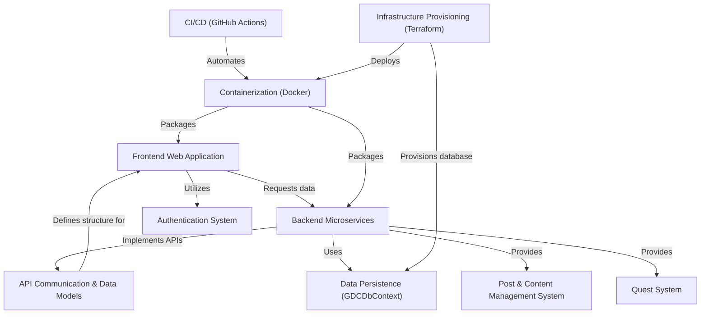

# Tutorial: Game Devs Connect

`Game Devs Connect` is an innovative social platform designed for game developers to **connect and collaborate**. It features a user-friendly *frontend application* built with Next.js, allowing users to browse and create posts, manage profiles, and participate in engaging quests. The platform's powerful functionalities are driven by a set of *independent backend microservices*, ensuring scalability and efficient management of user data, content, and challenges. The entire system's development and deployment processes are highly *automated* for reliability and speed.

## Visual Overview

## Chapters

1. [API Communication & Data Models
](01_api_communication_data_models.md)
2. [Frontend Web Application
](02_frontend_web_application.md)
3. [Authentication System
](03_authentication_system.md)
4. [Backend Microservices
](04_backend_microservices.md)
5. [Post & Content Management System
](05_post_content_management_system.md)
6. [Quest System
](06_quest_system.md)
7. [Data Persistence (GDCDbContext)
](07_data_persistence_gdcdbcontext.md)
8. [Containerization (Docker)
](08_containerization_docker.md)
9. [Infrastructure Provisioning (Terraform)
](09_infrastructure_provisioning_terraform.md)
10. [CI/CD (GitHub Actions)
](10_ci_cd_github_actions.md)
